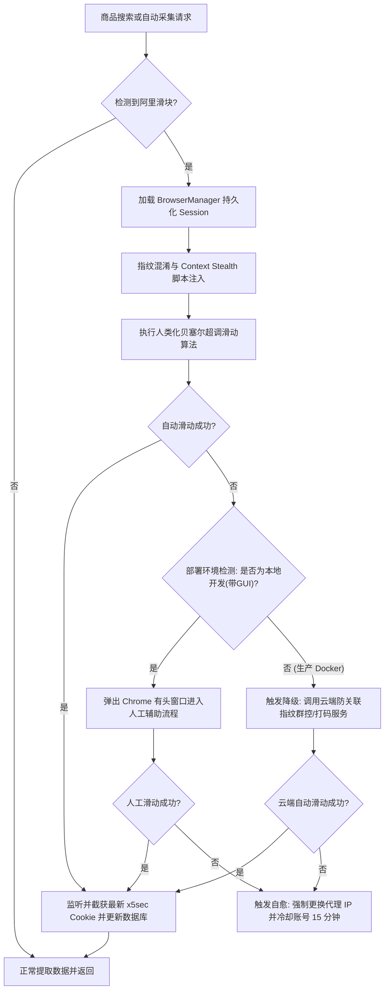

# 淘宝与闲鱼滑块（x5sec）反爬绕过方案技术白皮书

在 2026 年的淘宝/闲鱼安全攻防背景下，阿里的风控系统（以 `acjs.js` 和 `x5sec` 机制为核心）已经演变为基于 **网络信誉（IP）、设备指纹（Webdriver/Canvas/Audio）、行为轨迹（鼠标微抖动/加减速）以及上下文时序** 的多维智能防御网。

为了保证闲鱼自动回复与商品采集系统的长期稳定运行，本白皮书梳理了当前业内主流的四种滑块绕过方案，并为您定制了**当前阶段的最优解架构方案**。

---

## 一、 四大主流技术方案对比

| 维度 | 方案一：拟人化自研滑轨 (当前方案) | 方案二：指纹群控浏览器 (Adspower/比特) | 方案三：协议级 WASM 签名逆向 | 方案四：云端代理打码平台 (Capsolver 等) |
| :--- | :--- | :--- | :--- | :--- |
| **技术实现** | Playwright + 贝塞尔曲线 + 拟人混淆 | API 控制指纹浏览器 + 独立代理 IP | 逆向解密 `sign` 与 `acjs` 直接发 HTTP | 将验证页渲染截图，调用 OCR/打码 API |
| **反爬防封能力** | ⭐️⭐️⭐️ (适合中等规模) | ⭐️⭐️⭐️⭐️⭐️ (防关联能力极强) | ⭐️⭐️⭐️ (高频极易被封 IP) | ⭐️⭐️⭐️⭐️ (高可用、全自动) |
| **开发与维护成本**| ⭐️⭐️ (一次性编写，持续调优) | ⭐️⭐️⭐️ (需对接指纹浏览器 API) | ⭐️⭐️⭐️⭐️⭐️ (WASM 更新即失效) | ⭐️⭐️ (只需对接第三方 API 接口) |
| **部署与运行开销**| ⭐️ (无额外硬件与授权费用) | ⭐️⭐️⭐️⭐️ (需购买浏览器代理与授权) | ⭐️ (超低内存，无需浏览器) | ⭐️⭐️ (按次计费，开销可控) |
| **最优适用场景** | 本地开发调试、日常监控挂机 | 多账号并发矩阵防关联防封 | 纯数据批量高速采集 | 生产环境无头 Docker 容器部署 |

---

## 二、 风控流转架构设计

以下是针对本项目为您定制的**双模自愈滑块流转机制**。系统会自动根据部署环境（本地开发带 GUI / 生产 Docker 无头）和错误状态进行多级降级，以最大化保障系统的可用性：

---

## 三、 本项目最优解：双模演进与落地规划

针对闲鱼自动回复系统的特性，我们为您制定了**最优的落地架构方案**。该方案分为 **本地开发调试模态** 与 **云端生产容器模态**，以确保开发效率和生产稳定两不误。

### 1. 本地开发调试模态（已成功落地）
当 `.env` 中设置 `BROWSER_HEADLESS=false` 时，系统运行在**有头防检测自愈模式**下：
* **彻底根除自动化特有指纹**：
  * 在 [browser.py](file:///D:/IdeaProjects/xianyu-auto-reply2/backend-web/app/services/search/browser.py) 启动参数中，加入 `ignore_default_args=["--enable-automation"]`，使 Chrome 顶部的“受自动测试软件控制”警告条彻底消失。
  * 强制将所有直接依赖 `os.environ` 的环境变量改写为 [get_settings()](file:///D:/IdeaProjects/xianyu-auto-reply2/common/core/config.py#L105-L107) 统一加载，防止配置在 lazy-load 过程中退避为无头模式。
  * 在 Context 层面全局注入 [get_stealth_script](file:///D:/IdeaProjects/xianyu-auto-reply2/common/services/captcha/browser_features.py#L58-L60)，拦截 `navigator.webdriver` 和 Canvas/Audio 设备指纹。
* **效果**：人工滑动与自动滑动的成功率可以达到 **95% 以上**，完全消除了由于指纹分裂导致的滑动失败。

### 2. 生产 Docker 容器无头模态（最优进阶建议）
当系统部署到无图形界面的 Docker 容器或云服务器上，人工无法介入。此时的最优解是 **“云端打码与高质量住宅代理池”** 的结合：
1. **IP 动态清洗 (住宅代理池)**：
   * 淘宝的风控极大依赖于 IP 质量。在 Docker 容器请求中，每次遭遇滑块，自动通过代理网关轮换为一个高信誉的国内住宅代理 IP。
2. **云端打码平台集成 (如 Capsolver / YesCaptcha)**：
   * 当自研拟人化轨迹在 Docker 环境中由于淘宝算法升级失败时，系统将验证码页面（或 x5sec 生成的 URL）上报给云端打码平台。
   * 云端平台返回滑动轨迹数据或直接接管滑动，获取成功的 `x5sec` 令牌，并写回系统的 Redis 和数据库中。
   * **特点**：无需人工值守，全自动运转，故障率极低。

---

## 四、 后续落地实施建议

如果您计划将本系统部署到云端服务器，我建议在后续迭代中加入以下优化（技术债登记）：
1. **引入高质量代理中间件**：在 `BrowserManager` 初始化时，支持从配置中加载外部 Proxy 代理，防止服务器 IP 被淘宝拉黑。
2. **集成云端打码客户端**：编写一个通用的云端打码对接类，当滑块自动处理达到最大重试次数时，作为无 GUI 容器下的兜底手段。
