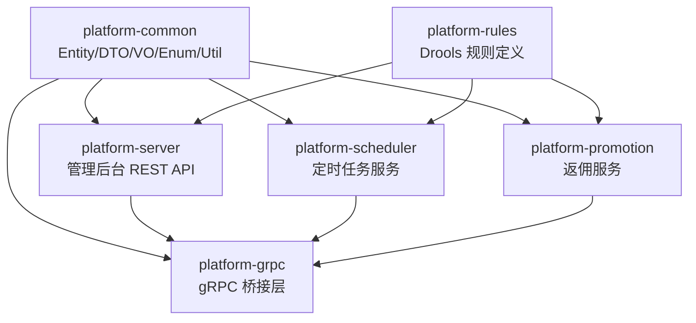
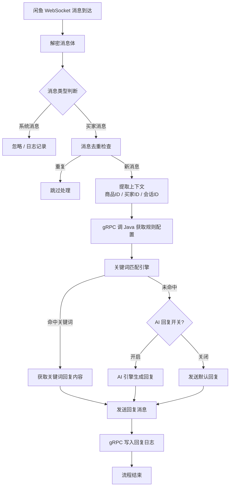
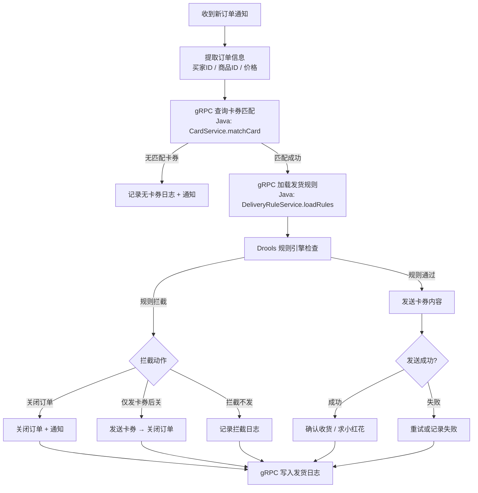
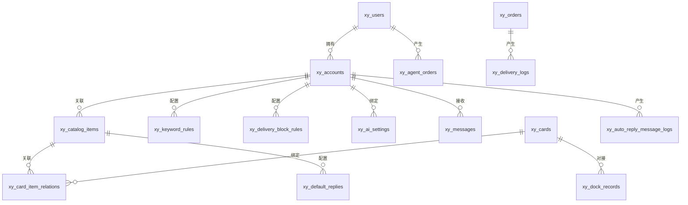
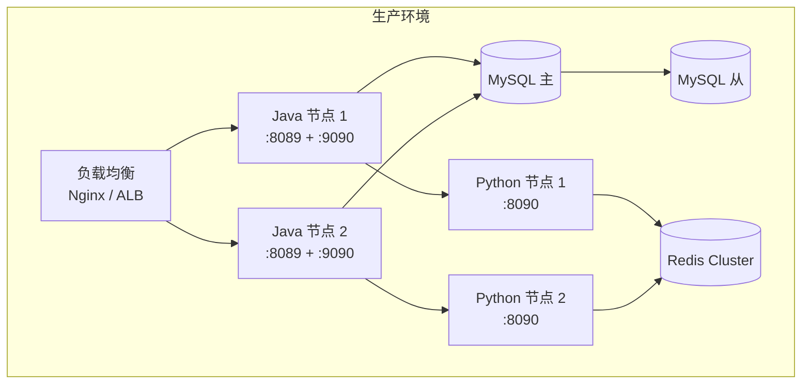

# 闲鱼自动回复系统 — 平台化架构设计文档

> 版本：v1.0 | 日期：2026-06-13 | 作者：架构组
>
> 本文档定义闲鱼智能运营平台 v2.0 的混合架构设计，包括系统架构、分层设计、数据流、gRPC 通信协议、规则引擎、多终端方案等。

---

## 目录

1. [设计原则与目标](#1-设计原则与目标)
2. [总体架构设计](#2-总体架构设计)
3. [Java 平台层设计](#3-java-平台层设计)
4. [Python 运行时引擎设计](#4-python-运行时引擎设计)
5. [gRPC 通信层设计](#5-grpc-通信层设计)
6. [规则引擎设计 (Drools)](#6-规则引擎设计-drools)
7. [数据库设计](#7-数据库设计)
8. [多终端架构](#8-多终端架构)
9. [安全架构](#9-安全架构)
10. [部署架构](#10-部署架构)

---

## 1. 设计原则与目标

### 1.1 架构设计原则

| 原则 | 说明 | 落地方式 |
|------|------|------|
| **最小改动** | 现有 Python 代码结构不变，新代码写入独立目录 | `vr_java_python/` 目录独立演进 |
| **边界清晰** | Java 与 Python 通过 gRPC 协议通信，不共享内存 | 按服务边界分工，各自独立部署 |
| **渐进迁移** | 分阶段交付，Python 服务逐步被 Java 替代或保留 | Phase 1-4 逐步推进 |
| **类型安全** | 编译期类型检查覆盖所有 Java 层代码 | Spring Boot 3 + MyBatis-Plus + Record |
| **高性能** | 虚拟线程处理高并发 I/O，gRPC 低延迟通信 | JDK 21 虚拟线程 + protobuf |
| **可观测** | 全链路追踪、结构化日志、指标监控 | Micrometer + SLF4J + Prometheus |

### 1.2 架构目标

| 目标 | 指标 | 说明 |
|------|------|------|
| 编译期安全 | 100% Java 层类型检查 | 54 张表 ORM 映射错误编译期暴露 |
| 规则可配置 | 发货规则 100% 声明式 | Drools 替代 5 种硬编码 if-else 规则 |
| 多终端统一 | 1 套 API 服务 5 端 | REST API 统一供应 PC/H5/小程序/Android/iOS |
| 通信延迟 | < 1ms 本地 gRPC | Java ↔ Python 服务间调用 |
| 代码复用 | 减少 40-50% 样板代码 | SmartAdmin 代码生成器 |

---

## 2. 总体架构设计

### 2.1 系统全景架构图

```mermaid
graph TB
    %% ====== 客户端层 ======
    subgraph "客户端层 Clients"
        PC["PC 管理后台<br/>Vue3 + Ant Design Vue"]
        H5["H5 移动端<br/>UniApp Vue3"]
        MP["微信小程序<br/>UniApp"]
        APP["Android/iOS<br/>UniApp"]
        EXT["第三方系统<br/>Open API"]
    end

    %% ====== 网关层 ======
    subgraph "网关层 Gateway"
        NGINX["Nginx :443<br/>反向代理 + HTTPS + WAF"]
    end

    %% ====== Java 平台层 ======
    subgraph "Java 平台层 Spring Boot 3 + JDK 21"
        direction TB

        subgraph "管理后台服务 Backend-Web :8089"
            BW_AUTH["认证鉴权 Sa-Token"]
            BW_USER["用户/角色/权限管理"]
            BW_ACT["账号管理 API"]
            BW_ITEM["商品/卡券管理"]
            BW_LOG["日志/报表查询"]
            BW_SYS["系统配置/运营"]
        end

        subgraph "调度服务 Scheduler :8091"
            SC_QUARTZ["Quartz 调度引擎"]
            SC_TASKS["15 个定时任务"]
        end

        subgraph "返佣服务 Promotion :8092"
            PM_CATALOG["选品库"]
            PM_MATERIAL["素材库"]
            PM_ORDER["代理订单/结算"]
        end

        subgraph "规则引擎 Drools"
            DR_DELIVERY["发货拦截规则"]
            DR_REPLY["回复策略规则"]
            DR_PROMO["返佣分成规则"]
        end
    end

    %% ====== gRPC 层 ======
    subgraph "通信层 gRPC"
        GRPC_SRV["gRPC Server :9090<br/>Proto 契约"]
        GRPC_CLI["gRPC Client"]
    end

    %% ====== Python 运行时引擎 ======
    subgraph "Python 运行时引擎 FastAPI"
        direction TB

        subgraph "WebSocket 服务 :8090"
            WS_CONN["闲鱼 WS 连接管理<br/>asyncio + 虚拟线程桥接"]
            WS_MSG["消息处理管道<br/>解密 → 去重 → 分类 → 路由"]
            WS_REPLY["回复引擎<br/>关键词 → AI → 默认"]
            WS_DELIVER["发货引擎<br/>卡券匹配 → 规则检查 → 发送"]
            WS_CAPTCHA["验证码处理<br/>滑块识别"]
        end

        subgraph "AI 引擎"
            AI_OAI["OpenAI"]
            AI_CLAUDE["Claude"]
            AI_GEMINI["Gemini"]
            AI_DASHS["DashScope"]
        end

        subgraph "Playwright 自动化"
            PL_LOGIN["扫码登录"]
            PL_COOKIE["Cookie 刷新"]
            PL_PUBLISH["商品发布"]
        end
    end

    %% ====== 基础设施层 ======
    subgraph "基础设施 Infrastructure"
        MYSQL[("MySQL 8.0<br/>54 张表")]
        REDIS[("Redis 7<br/>缓存/会话/规则")]
        MINIO[("MinIO<br/>文件/图片存储")]
    end

    %% ====== 监控运维层 ======
    subgraph "可观测性 Observability"
        PROM["Prometheus<br/>指标采集"]
        GRAF["Grafana<br/>可视化监控"]
        ELK["ELK / Loki<br/>日志聚合"]
    end

    %% 连接关系
    PC --> NGINX
    H5 --> NGINX
    MP --> NGINX
    APP --> NGINX
    EXT --> NGINX

    NGINX --> BW_AUTH
    NGINX --> PM_CATALOG

    BW_ACT -.-> GRPC_CLI
    SC_QUARTZ -.-> GRPC_CLI
    GRPC_CLI <--> GRPC_SRV
    GRPC_SRV --> WS_CONN

    BW_AUTH --> MYSQL
    BW_ITEM --> MYSQL
    SC_TASKS --> MYSQL
    PM_ORDER --> MYSQL

    WS_CONN --> REDIS
    WS_MSG --> REDIS
    BW_ITEM --> REDIS

    WS_MSG --> WS_REPLY
    WS_REPLY --> AI_OAI
    WS_REPLY --> AI_CLAUDE
    WS_REPLY --> AI_GEMINI
    WS_REPLY --> AI_DASHS

    WS_DELIVER --> DR_DELIVERY
    WS_REPLY --> DR_REPLY
    PM_ORDER --> DR_PROMO

    WS_CONN --> PL_LOGIN
    SC_TASKS --> PL_COOKIE
    SC_TASKS --> PL_PUBLISH

    PL_LOGIN --> MINIO
    BW_ITEM --> MINIO

    BW_AUTH -.-> PROM
    WS_CONN -.-> PROM
    PROM --> GRAF
    BW_AUTH -.-> ELK
    WS_MSG -.-> ELK
```



### 2.2 分层架构

| 层 | 职责 | 技术 | 说明 |
|------|------|------|------|
| 客户端层 | 用户界面 | Vue3 / UniApp | 多终端统一 API |
| 网关层 | 流量入口 | Nginx | 反向代理、HTTPS、限流 |
| Java 平台层 | 业务逻辑与数据主权 | Spring Boot 3 | 数据库主控、规则引擎、API 网关 |
| gRPC 通信层 | 跨语言服务调用 | gRPC + Protobuf | Java ↔ Python 桥接 |
| Python 运行时层 | 闲鱼连接与 AI 调用 | FastAPI + Playwright | 实时消息、AI 多模型、浏览器自动化 |
| 基础设施层 | 数据存储与缓存 | MySQL + Redis + MinIO | 持久化、缓存、文件 |
| 可观测层 | 监控与日志 | Prometheus + Grafana + ELK | 全链路追踪 |

### 2.3 项目目录结构

```
vr_java_python/                          # 新项目根目录
├── README.md
├── docker-compose.yml                   # 统一编排
│
├── java-platform/                       # Java 平台层
│   ├── pom.xml                          # Maven 父 POM
│   ├── platform-common/                 # 公共模块
│   │   ├── src/main/java/com/xyun/platform/common/
│   │   │   ├── entity/                  # JPA Entity（54 张表）
│   │   │   ├── dto/                     # 数据传输对象
│   │   │   ├── vo/                      # 视图对象
│   │   │   ├── enums/                   # 枚举
│   │   │   ├── exception/              # 业务异常
│   │   │   └── util/                   # 工具类
│   │   └── src/main/resources/
│   │
│   ├── platform-server/                 # 管理后台 API
│   │   ├── src/main/java/com/xyun/platform/server/
│   │   │   ├── controller/             # REST 控制器
│   │   │   ├── service/                # 业务服务
│   │   │   ├── repository/             # JPA Repository
│   │   │   ├── mapper/                 # MyBatis-Plus Mapper
│   │   │   ├── config/                 # 配置类
│   │   │   └── security/              # 安全配置
│   │   └── src/main/resources/
│   │       ├── application.yml
│   │       └── db/migration/           # Flyway 迁移脚本
│   │
│   ├── platform-scheduler/             # 定时任务服务
│   │   └── src/main/java/com/xyun/platform/scheduler/
│   │       ├── job/                    # Quartz Job 定义
│   │       └── config/                 # 调度配置
│   │
│   ├── platform-promotion/             # 返佣服务
│   │   └── src/main/java/com/xyun/platform/promotion/
│   │
│   ├── platform-rules/                 # 规则引擎
│   │   └── src/main/resources/
│   │       └── rules/                  # Drools DRL 规则文件
│   │           ├── delivery/           # 发货规则
│   │           ├── reply/              # 回复规则
│   │           └── promotion/          # 返佣规则
│   │
│   └── platform-grpc/                  # gRPC 桥接层
│       ├── src/main/proto/             # Proto 定义
│       │   ├── account.proto
│       │   ├── rule.proto
│       │   ├── message.proto
│       │   └── delivery.proto
│       └── src/main/java/com/xyun/platform/grpc/
│           ├── server/                 # gRPC Server
│           └── client/                 # gRPC Client
│
├── python-runtime/                     # Python 运行时（从现有项目提取）
│   ├── requirements.txt
│   ├── websocket_service/              # WebSocket 核心服务
│   │   ├── main.py
│   │   ├── app/
│   │   │   ├── services/
│   │   │   │   ├── xianyu_async.py     # 闲鱼连接
│   │   │   │   ├── auto_reply.py       # 自动回复
│   │   │   │   ├── auto_delivery.py    # 自动发货
│   │   │   │   ├── ai_engine.py        # AI 引擎
│   │   │   │   └── captcha_handler.py  # 验证码
│   │   │   └── grpc/
│   │   │       └── grpc_client.py      # gRPC 客户端
│   │   └── proto/                      # Proto 编译输出
│   │
│   └── playwright_service/             # Playwright 自动化
│       └── browser_worker.py
│
├── frontend/                           # 前端（从 SmartAdmin 改造）
│   ├── web-admin/                      # PC 管理后台
│   │   └── src/
│   │       ├── views/                  # 页面
│   │       │   ├── account/            # 账号管理
│   │       │   ├── item/               # 商品管理
│   │       │   ├── card/               # 卡券管理
│   │       │   ├── message/            # 消息日志
│   │       │   ├── order/              # 订单管理
│   │       │   ├── promotion/          # 返佣管理
│   │       │   ├── report/             # 数据报表
│   │       │   └── system/             # 系统管理
│   │       └── api/                    # API 调用层
│   │
│   └── mobile/                         # 移动端 UniApp
│       └── src/
│           ├── pages/
│           │   ├── dashboard/          # 工作台
│           │   ├── account/            # 账号状态
│           │   ├── message/            # 消息中心
│           │   └── order/              # 订单管理
│           └── api/
│
├── deployment/                         # 部署配置
│   ├── docker/
│   │   ├── Dockerfile.java
│   │   ├── Dockerfile.python
│   │   └── Dockerfile.nginx
│   ├── k8s/                            # Kubernetes 配置（远期）
│   └── nginx/
│       └── nginx.conf
│
└── docs/                               # 文档
    ├── prd.md
    ├── architecture.md
    ├── execution-plan.md
    └── references.md
```

---

## 3. Java 平台层设计

### 3.1 技术栈

| 组件 | 版本 | 说明 |
|------|------|------|
| JDK | 21 LTS | 虚拟线程 GA |
| Spring Boot | 3.5.x | 自动配置 + 起步依赖 |
| MyBatis-Plus | 3.5.15 | Lambda 查询 + 分页 + 代码生成 |
| Sa-Token | 1.40.0 | 轻量级权限认证 |
| Quartz | 2.4.x | 定时任务调度 |
| Drools | 9.x | 规则引擎 |
| gRPC | 1.68+ | 跨语言服务通信 |
| Flyway | 10.x | 数据库版本迁移 |
| Lombok | 1.18.x | 代码简化（禁止 `@Data` 用于 Entity） |

### 3.2 模块依赖关系



### 3.3 核心 Service 设计

| Service | 对应模块 | 核心方法 |
|------|------|------|
| `AccountService` | 账号管理 | `createAccount`, `updateCookie`, `getStatus`, `connectWs` |
| `ItemService` | 商品管理 | `listItems`, `updateAI Prompt`, `batchSetDefaultReply` |
| `CardService` | 卡券管理 | `createCard`, `bindItem`, `dockCard`, `useCard` |
| `KeywordRuleService` | 关键词规则 | `addRule`, `updateRule`, `deleteRule`, `testMatch` |
| `DeliveryRuleService` | 发货规则 | `loadRules`, `checkRules`, `logResult` |
| `AISettingService` | AI 配置 | `updateProvider`, `testConnection`, `switchModel` |
| `ReportService` | 数据报表 | `getDailyStats`, `getRevenueReport`, `getAgentReport` |
| `LicenseService` | 激活码管理 | `generateCode`, `validateCode`, `renewCode` |

### 3.4 虚拟线程配置

```yaml
# application.yml
spring:
  threads:
    virtual:
      enabled: true
  datasource:
    hikari:
      maximum-pool-size: 50  # 虚拟线程模式下连接池可大幅缩小
```

---

## 4. Python 运行时引擎设计

### 4.1 设计说明

Python 运行时引擎保留现有核心能力，作为**不可变的运行时组件**存在。它通过 gRPC 从 Java 平台层获取规则、配置和写入日志，但自身的消息处理、AI 调用、Playwright 自动化逻辑保持不变。

### 4.2 核心流程：消息处理管道



### 4.3 核心流程：自动发货管道



---

## 5. gRPC 通信层设计

### 5.1 Proto 服务定义

```protobuf
// account.proto
syntax = "proto3";
package xyun.platform;

service AccountService {
  rpc GetAccount (AccountRequest) returns (AccountResponse);
  rpc UpdateStatus (StatusRequest) returns (StatusResponse);
  rpc WriteLoginLog (LoginLogRequest) returns (Empty);
}

// rule.proto
service RuleService {
  rpc GetKeywordRules (RuleRequest) returns (RuleListResponse);
  rpc GetDeliveryRules (RuleRequest) returns (DeliveryRuleListResponse);
  rpc GetAISettings (AISettingRequest) returns (AISettingResponse);
  rpc GetDefaultReply (DefaultReplyRequest) returns (DefaultReplyResponse);
}

// message.proto
service MessageService {
  rpc WriteReplyLog (ReplyLogRequest) returns (Empty);
  rpc WriteAIChatMessage (AIChatRequest) returns (Empty);
  rpc CheckBlacklist (BlacklistRequest) returns (BlacklistResponse);
}

// delivery.proto
service DeliveryService {
  rpc MatchCard (MatchCardRequest) returns (MatchCardResponse);
  rpc WriteDeliveryLog (DeliveryLogRequest) returns (Empty);
  rpc GetOrderInfo (OrderRequest) returns (OrderResponse);
}
```

### 5.2 通信模式

| 场景 | 模式 | 频率 | 延迟要求 |
|------|------|:--:|------|
| 读取关键词规则 | Java → Redis → Python | 极高（每条消息） | < 1ms |
| 读取 AI 设置 | Java → Redis → Python | 高（每条 AI 消息） | < 1ms |
| 读取发货规则 | gRPC 同步调用 | 中（每个订单） | < 5ms |
| 写入回复日志 | gRPC 异步调用 | 极高（每条消息） | 无实时要求 |
| 写入发货日志 | gRPC 异步调用 | 中（每个订单） | 无实时要求 |
| 卡券匹配 | gRPC 同步调用 | 中（每个订单） | < 10ms |

### 5.3 缓存策略

```
┌────────────────────────────────────────────────────┐
│                  数据访问路径                       │
│                                                     │
│  Java 规则变更 → 写 MySQL + 刷新 Redis              │
│                      ↓                              │
│  Python 读规则 → 先查 Redis → 未命中 → gRPC → Java │
│                                                     │
│  缓存策略：                                          │
│  · 关键词规则：Redis Hash，按 account_id 分组      │
│  · AI 设置：Redis String，JSON 序列化               │
│  · 默认回复：Redis String，按 item_id 索引          │
│  · 黑名单：Redis Set，按 account_id 分组            │
│  · TTL：规则变更时主动刷新，兜底 5 分钟过期          │
└────────────────────────────────────────────────────┘
```

---

## 6. 规则引擎设计 (Drools)

### 6.1 当前硬编码规则 → Drools 声明式规则

**现状（Python 硬编码）：**

```python
# delivery_rules/buyer_credit_rule.py
if buyer_credit_score < threshold:
    return RuleCheckResult(block=True, reason="买家信用不足")
```

**目标（Drools 声明式）：**

```drools
// delivery/buyer_credit.drl
rule "Buyer Credit Check"
    when
        $ctx : DeliveryContext(
            buyerCreditScore < creditThreshold,
            excludedItems not contains itemId
        )
    then
        $ctx.setBlocked(true);
        $ctx.setBlockReason("买家信用不足（" + $ctx.getBuyerCreditScore() + " < " + $ctx.getCreditThreshold() + "）");
end
```

### 6.2 规则类型与优先级

| 规则类型 | 优先级 | 规则名 | 动作 |
|------|:--:|------|------|
| 买家信用 | 1 | `buyer_credit_check` | 拦截禁止发货 |
| 历史订单 | 2 | `buyer_has_order_check` | 已有未完成订单则拦截 |
| 未确认收货 | 3 | `buyer_unconfirmed_check` | 存在未收货订单则拦截 |
| 个人黑名单 | 4 | `personal_blacklist_check` | 黑名单拦截 |
| 发货后关单 | 5 | `delivery_only_card_after_close` | 发卡券后关闭订单 |
| 卡券匹配 | 10 | `card_match_check` | 匹配不到卡券则拦截 |
| 全局开关 | 99 | `delivery_disabled_check` | 账号级发货开关 |

### 6.3 规则热加载方案

```
┌─────────────────────────────────────────┐
│            规则管理流程                   │
│                                          │
│  管理后台编辑规则 → 存 MySQL             │
│       ↓                                  │
│  Java 规则服务编译 .drl → KieContainer  │
│       ↓                                  │
│  Python gRPC 调用 → 获取最新规则结果     │
│                                          │
│  注意：规则执行在 Java 侧，Python 只     │
│  传递上下文数据，获取检查结果。           │
└─────────────────────────────────────────┘
```

---

## 7. 数据库设计

### 7.1 现有表迁移策略

| 策略 | 表数量 | 表类型 | 说明 |
|------|:--:|------|------|
| 完整迁移到 Java | ~40 | 业务核心表 | 用户、账号、卡券、商品、订单等 |
| 保留在 Python | ~10 | 运行时日志表 | 消息日志、AI 聊天记录 |
| 返佣表 | ~23 | `fy_*` 前缀 | 完整迁移到 Java |

### 7.2 核心表关系图



---

## 8. 多终端架构

### 8.1 终端共享架构

```
┌──────────────────────────────────────────────────────────┐
│                    统一 REST API 网关                      │
│                 Java Backend-Web :8089                     │
│                /api/v2/accounts                           │
│                /api/v2/items                              │
│                /api/v2/cards                              │
│                /api/v2/messages                           │
│                /api/v2/orders                             │
│                /api/v2/reports                            │
└──────┬──────────┬──────────┬──────────┬──────────────────┘
       │          │          │          │
  ┌────▼───┐ ┌───▼────┐ ┌───▼───┐ ┌───▼────┐
  │ PC Web │ │  H5    │ │小程序 │ │  App   │
  │ Vue3   │ │ UniApp │ │UniApp │ │ UniApp  │
  │ AD Vue │ │Vue3    │ │Vue3   │ │ Vue3   │
  └────────┘ └────────┘ └───────┘ └────────┘
```

### 8.2 API 版本策略

| 版本 | 路径前缀 | 状态 |
|------|------|------|
| v1 | `/api/v1/` | 兼容现有 React 前端 |
| v2 | `/api/v2/` | 新 Vue 前端 + 移动端 |

---

## 9. 安全架构

### 9.1 安全分层

```
┌────────────────────────────────────────────┐
│          应用层安全                          │
│  Sa-Token 认证 · RBAC 授权 · 接口鉴权       │
│  数据脱敏 · 操作审计 · 验证码防刷            │
├────────────────────────────────────────────┤
│          传输层安全                          │
│  HTTPS · 国密 SM4 接口加密                  │
│  JWT Token 签名 · API 签名验证              │
├────────────────────────────────────────────┤
│          存储层安全                          │
│  Cookie: AES-256 加密 · AI Key: 加密分离    │
│  密码: BCrypt 哈希 · DB 连接: TLS            │
├────────────────────────────────────────────┤
│          基础设施安全                        │
│  Nginx WAF · Fail2ban · 防火墙规则          │
│  Docker 非 root 运行 · 最小权限原则          │
└────────────────────────────────────────────┘
```

---

## 10. 部署架构

### 10.1 Docker Compose 编排

```yaml
version: "3.8"
services:
  nginx:
    image: nginx:alpine
    ports: ["443:443"]
    volumes: ["./deployment/nginx/nginx.conf:/etc/nginx/nginx.conf"]

  java-platform:
    build: ./deployment/docker/Dockerfile.java
    ports: ["8089:8089", "9090:9090"]  # REST + gRPC
    environment:
      - SPRING_PROFILES_ACTIVE=prod
    depends_on: [mysql, redis]

  python-websocket:
    build: ./deployment/docker/Dockerfile.python
    ports: ["8090:8090"]
    depends_on: [java-platform, redis]

  mysql:
    image: mysql:8.0
    environment:
      MYSQL_ROOT_PASSWORD: ${DB_ROOT_PASSWORD}
    volumes: ["./data/mysql:/var/lib/mysql"]

  redis:
    image: redis:7-alpine
    volumes: ["./data/redis:/data"]
```

### 10.2 生产部署拓扑



---

## 附录：架构决策记录 (ADR)

| ID | 决策 | 理由 | 替代方案 |
|:--|------|------|------|
| ADR-001 | 使用 SmartAdmin 作为 Java 基座 | 技术栈最新、三级等保、多终端 | 若依 |
| ADR-002 | JDK 21（非 17） | 虚拟线程 GA，Spring Boot 4 兼容 | JDK 17 / JDK 25 |
| ADR-003 | gRPC 桥接（非 HTTP REST） | 低延迟、强类型、双向流 | HTTP REST |
| ADR-004 | Drools 规则引擎 | 声明式规则、热加载、可视化编辑 | 硬编码 / Easy Rules |
| ADR-005 | MySQL 8.0（非 PostgreSQL） | 兼容现有 54 张表 | PostgreSQL |
| ADR-006 | Java 写主库，Python 读 Redis | 避免跨语言"双写"，降延迟 | 全部走 gRPC |
| ADR-007 | MyBatis-Plus（非 JPA） | SmartAdmin 原配，Lambda 查询 | JPA/Hibernate |