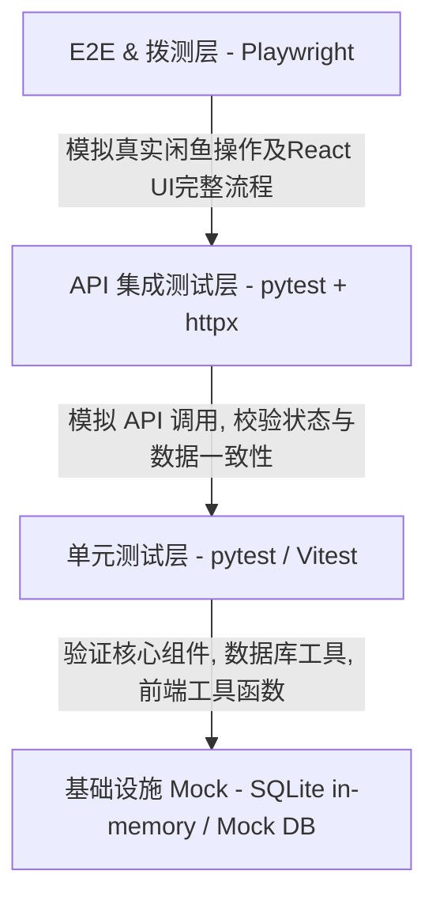

# 闲鱼自动回复系统 - 自动化测试架构与规范文档

本文件定义了闲鱼自动回复系统（`xianyu-auto-reply2`）的自动化测试模型、项目测试目录结构、具体技术栈选型以及执行与维护规则。

---

## 1. 自动化测试分层模型 (Testing Pyramid)

针对本系统的分布式、多模块（Web API、WebSocket、定时任务、React 前端）以及高度依赖 Playwright 模拟浏览器操作的特点，测试模型设计如下：



### 1.1 单元测试 (Unit Tests)
* **后端 (Python)**：针对 `common/`、`db_manager.py` 内的公共逻辑进行高覆盖率测试。主要测试数据加解密、字符串处理、回复规则的匹配引擎算法。
* **前端 (React/Vite)**：针对 `frontend/src/utils/` 下的工具类、Zustand 的状态管理逻辑进行单体测试。

### 1.2 API 集成测试 (Integration Tests)
* **FastAPI 接口测试**：使用 `pytest-asyncio` 与 `httpx.AsyncClient` 异步拉起测试客户端，直接请求路由端点（Endpoints）。
* **测试数据库隔离**：集成测试时，使用内存型 SQLite (`sqlite+aiosqlite`) 动态替代生产环境 of MySQL，防止测试数据污染真实数据库，并利用 SQLAlchemy 完成每次测试后的回滚（Session Rollback）。

### 1.3 E2E 浏览器与仿真测试 (End-to-End & Playwright Simulation)
这是本项目的**重难点**。由于闲鱼没有开放官方 API，系统使用 Playwright 模拟真实浏览器行为。
* **网页选择器（Selectors）健壮性测试**：专门针对闲鱼网页版 HTML 结构中的核心 DOM 节点（消息输入框、发送按钮、未读红点等）设计特定测试，以便在闲鱼前端升级时第一时间发出警报。
* **管理后台 UI 测试**：使用 Playwright 自动拉起 React 前端，模拟管理员从扫码授权、配置回复规则、到查看消息历史的闭环流程。

---

## 2. 自动化测试目录结构

项目测试结构配置如下：

```text
D:\IdeaProjects\xianyu-auto-reply2
├── backend-web/
│   ├── pytest.ini               # pytest 运行配置
│   └── tests/                   # 后端测试目录
│       ├── conftest.py          # 全局 Fixtures (数据库隔离、客户端初始化)
│       ├── test_main.py         # 基础健康检查与API测试
│       └── test_rule_engine.py  # 自动回复规则引擎测试
├── frontend/
│   ├── vitest.config.ts         # 前端单元测试配置 (使用 Vitest)
│   └── src/
│       └── __tests__/           # 前端单体与组件测试
│           └── store.test.ts    # 状态库测试
├── tests/
│   └── e2e/                     # 全局 E2E 与闲鱼页面模拟测试
│       ├── conftest.py          # 浏览器环境配置
│       ├── test_xianyu_login.py # 闲鱼扫码/Cookie刷新模块仿真测试
│       └── test_admin_flow.py   # React 后台管理端 E2E 测试
└── kendocs/
    └── AUTOMATED_TESTING.md      # [当前文档] 自动化测试规范与指南
```

---

## 3. 配置文件规范与示例

### 3.1 后端 `pytest.ini` 规范
后端测试配置文件需要声明测试发现路径、异步执行模式（`auto`）以及忽略敏感的运行时或构建目录。

```ini
[pytest]
testpaths = tests
python_files = test_*.py
python_classes = Test*
python_functions = test_*
asyncio_mode = auto
filterwarnings =
    ignore::DeprecationWarning
    ignore::UserWarning
```

### 3.2 后端全局 Fixtures (`conftest.py`) 示例
实现数据库隔离的核心代码。通过 Mock SQLAlchemy 的引擎，在测试启动时创建 SQLite 内存表，在每次测试结束后自动丢弃。

```python
import pytest
from typing import AsyncGenerator
from sqlalchemy.ext.asyncio import create_async_engine, AsyncSession
from sqlalchemy.orm import sessionmaker
from fastapi import FastAPI
from httpx import AsyncClient
from app.main import app # 替换为具体的入口
from app.db import Base, get_db

# 1. 使用内存 SQLite 作为测试 DB
TEST_DATABASE_URL = "sqlite+aiosqlite:///:memory:"
engine = create_async_engine(TEST_DATABASE_URL, echo=False)
TestingSessionLocal = sessionmaker(engine, class_=AsyncSession, expire_on_commit=False)

@pytest.fixture(scope="session", autouse=True)
async def initialize_test_db():
    # 测试前创建表结构
    async with engine.begin() as conn:
        await conn.run_sync(Base.metadata.create_all)
    yield
    # 测试后销毁
    async with engine.begin() as conn:
        await conn.run_sync(Base.metadata.drop_all)

@pytest.fixture
async def db_session() -> AsyncGenerator[AsyncSession, None]:
    async with TestingSessionLocal() as session:
        yield session

@pytest.fixture
async def client(db_session) -> AsyncGenerator[AsyncClient, None]:
    # 2. 依赖注入：用测试数据库 Session 替换 FastAPI 的依赖
    async def override_get_db():
        try:
            yield db_session
        finally:
            pass
    app.dependency_overrides[get_db] = override_get_db
    
    async with AsyncClient(app=app, base_url="http://test") as ac:
        yield ac
    
    app.dependency_overrides.clear()
```

---

## 4. 自动化测试执行与维护指南

### 4.1 测试执行命令

* **运行后端全部测试**（在 `backend-web/` 目录下执行）：
  ```bash
  pytest -v --tb=short
  ```

* **运行特定模块 Jun 测试**：
  ```bash
  pytest tests/test_rule_engine.py -k "test_matching_logic"
  ```

* **运行前端 Vitest 单元测试**（在 `frontend/` 目录下执行）：
  ```bash
  npm run test # 需配置 package.json 脚本 "test": "vitest run"
  ```

* **运行 E2E 仿真拨测**（在根目录下的 `tests/e2e/` 执行，通常在开发阶段使用 `--headed` 可视化模式）：
  ```bash
  pytest tests/e2e/ --headed
  ```

### 4.2 Playwright 仿真测试防风控封号规则

由于闲鱼网页端有极高强度的风控（如滑块验证码、检测 `navigator.webdriver` 属性、异常操作频率限制等），测试代码中已针对性地集成了伪装技术。在编写和维护仿真测试时，**必须严格遵循以下规避机制**：

1. **持久化环境复用（核心）**：
   * 测试通过 [conftest.py](file:///D:/IdeaProjects/xianyu-auto-reply2/tests/e2e/conftest.py) 中定义的 `stealth_context` Fixture 启动持久化上下文：
     ```python
     p.chromium.launch_persistent_context(user_data_dir=".xianyu_browser_data", ...)
     ```
   * 它将所有 Cookies、缓存和历史记录保存在本地目录中。只要在 `headed` 可视化模式下**手动扫码登录一次**，后续测试都将保持登录状态，从而避免了每次测试启动时因“全新设备频繁重登”触发的风控验证。

2. **清除自动化测试标记（Stealth）**：
   * 严禁直接使用未经修改的 Playwright 默认浏览器。
   * 启动时必须传入隐藏自动化控制特征的参数：`--disable-blink-features=AutomationControlled`。
   * 每一个测试 Page 均通过 [stealth_utils.py](file:///D:/IdeaProjects/xianyu-auto-reply2/tests/e2e/stealth_utils.py) 中的 `apply_stealth(page)` 注入反检测 JavaScript，覆盖 `navigator.webdriver` 为 `undefined`，并伪造 `chrome.runtime` 和 WebGL Render 指纹。

3. **人类化操作（Human Mimicry）**：
   * **输入操作**：严禁直接使用 `page.fill()`，必须调用 `human_type(page, selector, text)` 模拟人类逐字输入，并带有 50ms-250ms 的随机时间抖动。
   * **点击操作**：严禁直接调用 `page.click()`。必须调用 `human_click(page, selector)`，该方法会模拟鼠标滑过（hover）目标元素、停顿，再产生物理点击。
   * **滚动操作**：使用 `human_scroll(page)` 产生分步的平滑滚动，模拟人类浏览商品的视觉停顿。

4. **元素等待原则**：
   * 严禁使用硬编码同步休眠（如 `time.sleep(5)`），这会使机器行为在特征统计上表现得极其僵硬。
   * 必须使用 Playwright 提供的智能异步等待，如 `page.wait_for_selector()` 或 `page.wait_for_load_state()`。

### 4.3 CI/CD 集成流水线建议
每次代码提交（Git Push）或合并请求（PR）时，应自动在 GitHub Actions 或 Gitlab CI 中拉起：
1. 后端单元与集成测试（使用 MySQL 容器镜像或 SQLite 内存隔离）。
2. 前端 Lint 与编译检查（`npm run lint && npm run build`）。
3. **Playwright 核心 DOM 节点校验测试**：使用配置好的代理池定期校验闲鱼页面 DOM 变化。若检测到闲鱼前端改版或选择器失效，第一时间触发报警（发送 Webhook 消息至开发群组），以便人工介入更新解析逻辑，防止生成环境回复失效。

