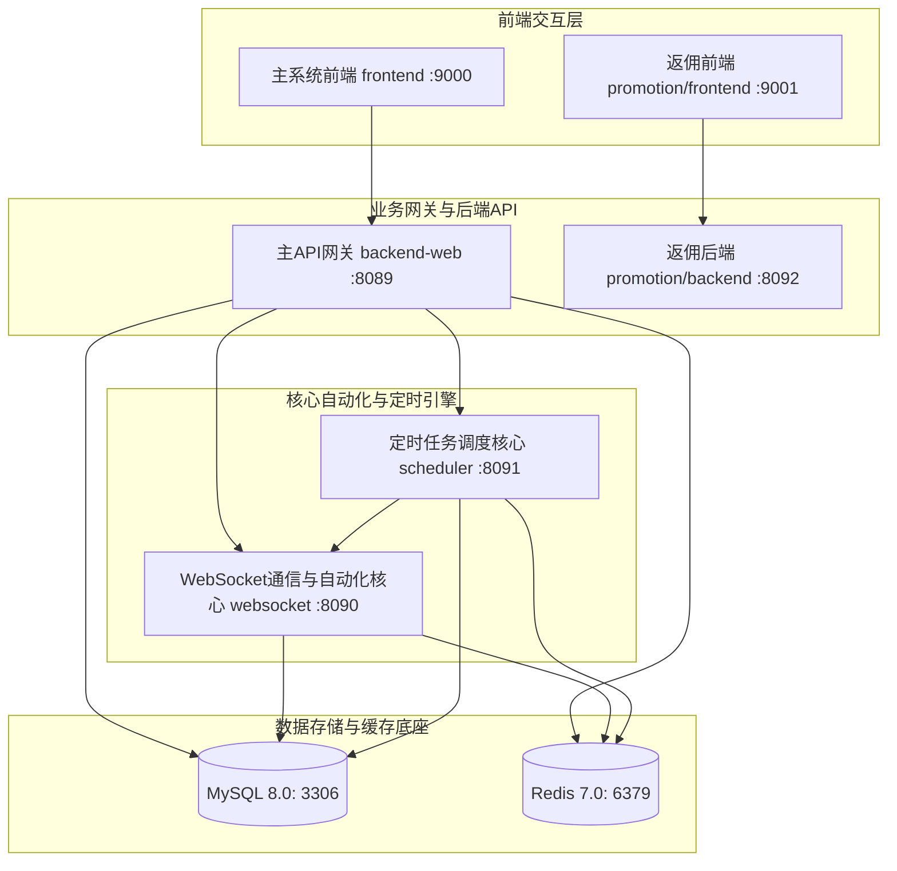

# 闲鱼自动回复与运营系统 — 完整项目说明与开发手册

> **声明：** 本文档基于源码 AST 静态分析生成，包含全量数据库表、API 路由以及核心服务类图谱，是项目本地开发调试与二次开发的技术蓝图。

## 目录
1. [系统总体架构与服务职责](#1-系统总体架构与服务职责)
2. [数据库设计与模型图谱 (57个表)](#2-数据库设计与模型图谱)
3. [API 接口设计与路由蓝图 (361个端点)](#3-api-接口设计与路由蓝图)
4. [核心服务类与自动化逻辑 (20个核心类)](#4-核心服务类与自动化逻辑)
5. [本地开发与源码调试指南](#5-本地开发与源码调试指南)
6. [项目运维部署与风控安全](#6-项目运维部署与风控安全)

## 1. 系统总体架构与服务职责
本项目基于微服务/多服务设计思想，将复杂的闲鱼自动化流程拆分为 5 个职责明确的服务模块。服务之间通过 HTTP REST 与 Socket.IO 保持轻量级通信，数据持久化采用 MySQL 与 Redis 双底座。



### 服务职责表
| 服务目录 | 默认端口 | 职责描述 | 核心技术栈 |
| :--- | :--- | :--- | :--- |
| `frontend` | `9000` | 统一管理后台。展示账号状态、聊天面板、规则配置、商品采集与发布日志。 | React 18, TS, TailwindCSS, Zustand |
| `backend-web` | `8089` | 主系统的业务 API 网关。处理用户鉴权、规则 CRUD、商品/订单管理、分销对接等逻辑。 | FastAPI, SQLAlchemy 2.0, Pydantic |
| `websocket` | `8090` | 核心自动化引擎。维持与闲鱼底层的持久连接（WebSocket），负责消息收发、扫码登录以及 Playwright 滑动验证码拦截与处理。 | FastAPI, Playwright (Python), python-socketio |
| `scheduler` | `8091` | 任务调度执行器。驱动卡券补发、Cookie 定时刷新续期、擦亮商品、订单同步等非即时性任务。 | FastAPI, APScheduler |
| `common` | - | 内部共享库。封装了 57 个表的 SQLAlchemy 模型、Pydantic 验证 Schema、数据库连接池、Redis 连接池、日志工具类等。 | Python Module |
| `promotion` | `9001/8092` | 返佣推广子系统。前后端分离设计，专门用于返佣选品、淘口令转换、定时上架返佣商品与自动删除规则。 | FastAPI, React 18 |

## 2. 数据库设计与模型图谱
通过 AST 全量扫描，项目共定义了 **57** 个持久化实体模型。
表命名遵循以下规范：
* `xy_` 前缀：主系统业务表
* `fy_` 前缀：返佣推广子系统业务表
* `scheduled_` 前缀：各类定时任务与日志审计表

### 全表结构概要
| 实体类名 | 物理表名 | 模块/说明 | 包含字段 |
| :--- | :--- | :--- | :--- |
| `AIChatMessage` | `xy_ai_chat_messages` | AI聊天消息表 |  |
| `Advertisement` | `xy_advertisements` | 广告表 |  |
| `AgentOrder` | `xy_agent_orders` | 代理订单表 - 记录对接卡券发货产生的订单 |  |
| `Announcement` | `xy_announcements` | 公告信息表 |  |
| `AutoRateConfig` | `xy_auto_rate_configs` | 自动评价配置表 |  |
| `Card` | `xy_cards` | 卡券表 | user, item_relations |
| `CardItemRelation` | `xy_card_item_relations` | 卡券商品关联表 - 多对多关系 |  |
| `ChatQuickPhrase` | `xy_chat_quick_phrases` | 归属于单个后台用户的可复用快捷短语 |  |
| `ConfirmReceiptMessage` | `xy_confirm_receipt_messages` | 确认收货消息设置表 |  |
| `CookieRefreshSchedule` | `xy_cookie_refresh_schedules` | Cookie续期计划表。 |  |
| `DbBackupLog` | `xy_db_backup_log` | 数据库备份日志表 |  |
| `DefaultReply` | `xy_default_replies` | 默认回复设置表（支持账号级别和商品级别） |  |
| `DefaultReplyRecord` | `xy_default_reply_records` | 默认回复记录表（记录已回复过的用户，支持账号级别和商品级别） |  |
| `DockCodeBinding` | `xy_dock_code_bindings` | 对接码绑定表 |  |
| `DockRecord` | `xy_dock_records` | 对接记录表 |  |
| `FYAccount` | `fy_accounts` | 返佣系统推广账号表 |  |
| `FYDeleteRule` | `fy_delete_rules` | 返佣系统删除规则表 |  |
| `FYMaterial` | `fy_materials` | 返佣系统素材库表 |  |
| `FYProductRule` | `fy_product_rules` | 返佣系统选品规则表 |  |
| `FYPublishRule` | `fy_publish_rules` | 返佣系统发布规则表 |  |
| `Feedback` | `xy_feedbacks` | 意见反馈表 |  |
| `FeedbackMessage` | `xy_feedback_messages` | 反馈消息表（对话记录） |  |
| `FundFlow` | `xy_fund_flows` | 资金流水表 |  |
| `GoofishCrawlItem` | `xy_goofish_crawl_items` | 暂无说明 |  |
| `GoofishCrawlJob` | `xy_goofish_crawl_jobs` | 暂无说明 |  |
| `MessageNotification` | `xy_message_notifications` | 消息通知表 - 关联账号和通知渠道 |  |
| `NotificationChannel` | `xy_notification_channels` | 通知渠道表 - 配置消息通知渠道 |  |
| `ProductMaterial` | `xy_product_materials` | 商品素材库表 - 存储可复用的商品发布模板 |  |
| `PublishAddress` | `xy_publish_addresses` | 商品发布随机地址池表 |  |
| `PublishLog` | `xy_publish_logs` | 商品发布日志表 - 记录每次发布操作的结果 |  |
| `RechargeOrder` | `xy_recharge_orders` | 充值订单表 |  |
| `ScheduledApiCookieRenewLog` | `xy_scheduled_api_cookie_renew_log` | 接口续期Cookies执行日志表。 |  |
| `ScheduledCloseNoticeLog` | `xy_scheduled_close_notice_log` | 账号消息通知关闭执行日志表 |  |
| `ScheduledCookiesRefreshLog` | `xy_scheduled_cookies_refresh_log` | COOKIES刷新日志表。 |  |
| `ScheduledLoginRenewLog` | `xy_scheduled_login_renew_log` | 登录续期执行日志表 |  |
| `ScheduledPolishLog` | `xy_scheduled_polish_log` | 定时擦亮执行日志表 |  |
| `ScheduledRateLog` | `xy_scheduled_rate_log` | 定时补评价执行日志表 |  |
| `ScheduledRedFlowerLog` | `xy_scheduled_red_flower_log` | 定时求小红花执行日志表 |  |
| `ScheduledRedeliveryLog` | `xy_scheduled_redelivery_log` | 定时补发货执行日志表 |  |
| `ScheduledTask` | `xy_scheduled_tasks` | 定时任务配置表 |  |
| `SettlementRecord` | `xy_settlement_records` | 用户结算记录表 |  |
| `SharedScanSession` | `xy_shared_scan_sessions` | 共享扫码登录会话表 |  |
| `SharedScanWorker` | `xy_shared_scan_workers` | 共享扫码登录兼职工作者表 |  |
| `SystemSetting` | `xy_system_settings` | 系统设置表 - 存储全局键值对配置 |  |
| `TokenCache` | `xy_token_cache` | Token缓存表 |  |
| `User` | `xy_users` | 用户表 |  |
| `UserSetting` | `xy_user_settings` | 用户个人设置表 |  |
| `XYAccount` | `xy_accounts` | 闲鱼账号表 |  |
| `XYAccountLoginLog` | `xy_account_login_logs` | 账号登录日志表 - 记录账号密码登录每一次尝试与结果 |  |
| `XYAutoReplyMessageLog` | `xy_auto_reply_message_logs` | 自动回复消息日志表 |  |
| `XYCatalogItem` | `xy_catalog_items` | 商品目录表 - 缓存闲鱼商品信息 | card_relations |
| `XYDeliveryBlockRule` | `xy_delivery_block_rules` | 禁止发货规则配置表 |  |
| `XYKeywordRule` | `xy_keyword_rules` | 关键词规则表 - 存储账号的自动回复关键词配置 |  |
| `XYOrder` | `xy_orders` | 订单表 - 存储从闲鱼同步的订单信息 |  |
| `XYPersonalBlacklist` | `xy_personal_blacklist` | 个人黑名单表 |  |
| `XYPlatformBlacklist` | `xy_platform_blacklist` | 闲鱼黑名单表 |  |
| `XYRiskControlLog` | `xy_risk_control_logs` | 风控日志表 - 记录账号的风控事件 |  |

## 3. API 接口设计与路由蓝图
项目后端网关一共构建了 **361** 个接口路由端点，涵盖了业务、自动化、数据统计和系统管理全维度。

### 核心路由组清单

#### 📁 account_login_logs.py (1 个端点)
| 方法 | 路径 | 对应函数 | 接口说明 |
| :--- | :--- | :--- | :--- |
| `GET` | `/account-login-logs` | `list_account_login_logs` | 分页查询账号登录日志（仅管理员，返回所有账号的全部数据） |

#### 📁 account_sync.py (1 个端点)
| 方法 | 路径 | 对应函数 | 接口说明 |
| :--- | :--- | :--- | :--- |
| `POST` | `/sync` | `sync_accounts` | 同步商品：从源账号 → 目标账号 |

#### 📁 activation.py (3 个端点)
| 方法 | 路径 | 对应函数 | 接口说明 |
| :--- | :--- | :--- | :--- |
| `POST` | `/generate` | `generate_trial_activation` | 生成试用激活码（公开接口，无需登录） |
| `POST` | `/renew` | `generate_renew_activation` | 生成续期码（公开接口，无需登录） |
| `POST` | `/history` | `get_activation_history` | 查询激活码生成历史记录（公开接口，无需登录） |

#### 📁 admin.py (40 个端点)
| 方法 | 路径 | 对应函数 | 接口说明 |
| :--- | :--- | :--- | :--- |
| `GET` | `/users` | `list_users` | 暂无说明 |
| `POST` | `/users` | `create_user` | 暂无说明 |
| `PUT` | `/users/{user_id}` | `update_user` | 暂无说明 |
| `DELETE` | `/users/{user_id}` | `delete_user` | 暂无说明 |
| `DELETE` | `/risk-control-logs` | `clear_risk_logs` | 批量清空风控日志 |
| `DELETE` | `/account-login-logs` | `clear_account_login_logs` | 清理账号登录日志 |
| `GET` | `/data/{table_name}` | `get_table_data` | 暂无说明 |
| `DELETE` | `/data/{table_name}` | `clear_table_placeholder` | 暂无说明 |
| `DELETE` | `/data/{table_name}/{record_id}` | `delete_table_record_placeholder` | 暂无说明 |
| `GET` | `/logs` | `get_system_logs` | 暂无说明 |
| `POST` | `/logs/clear` | `clear_system_logs` | 清空系统日志 |
| `GET` | `/logs/export` | `export_log_file` | 导出指定的日志文件 |
| `GET` | `/stats` | `get_system_stats` | 获取系统统计信息 |
| `GET` | `/stats/today` | `get_today_stats` | 获取今日统计信息（管理员专用） |
| `GET` | `/log-files` | `get_log_files` | 获取日志文件列表 |
| `GET` | `/backup/list` | `list_backup_files` | 列出备份文件 |
| `GET` | `/backup/download` | `download_database_backup` | 下载数据库备份（MySQL不支持直接下载） |
| `POST` | `/backup/upload` | `upload_database_backup` | 上传数据库备份（MySQL不支持直接上传恢复） |
| `POST` | `/reload-cache` | `reload_system_cache` | 刷新系统缓存 |
| `GET` | `/redelivery-batches` | `list_redelivery_batches` | 获取定时补发货执行批次列表（管理员专用） |
| `GET` | `/redelivery-batches/{batch_id}` | `get_redelivery_batch_detail` | 获取定时补发货执行批次详情（管理员专用） |
| `GET` | `/rate-batches` | `list_rate_batches` | 获取定时补评价执行批次列表（管理员专用） |
| `GET` | `/rate-batches/{batch_id}` | `get_rate_batch_detail` | 获取定时补评价执行批次详情（管理员专用） |
| `GET` | `/scheduled-tasks` | `list_scheduled_tasks` | 获取定时任务列表（管理员专用） |
| `PUT` | `/scheduled-tasks/{task_code}` | `update_scheduled_task` | 更新定时任务配置（管理员专用） |
| `POST` | `/scheduled-tasks/{task_code}/trigger` | `trigger_scheduled_task` | 手动触发定时任务执行（管理员专用） |
| `GET` | `/polish-batches` | `list_polish_batches` | 获取定时擦亮执行批次列表（管理员专用） |
| `GET` | `/polish-batches/{batch_id}` | `get_polish_batch_detail` | 获取定时擦亮执行批次详情（管理员专用） |
| `DELETE` | `/redelivery-logs/clear` | `clear_redelivery_logs` | 清空定时补发货日志（只清空30天前的数据） |
| `DELETE` | `/rate-logs/clear` | `clear_rate_logs` | 清空定时补评价日志（只清空30天前的数据） |
| `DELETE` | `/polish-logs/clear` | `clear_polish_logs` | 清空定时擦亮日志（只清空30天前的数据） |
| `GET` | `/red-flower-batches` | `list_red_flower_batches` | 获取求小红花执行批次列表（管理员专用） |
| `GET` | `/red-flower-batches/{batch_id}` | `get_red_flower_batch_detail` | 获取求小红花批次详情（管理员专用） |
| `DELETE` | `/red-flower-logs/clear` | `clear_red_flower_logs` | 清空求小红花日志（只清空30天前的数据） |
| `GET` | `/login-renew-batches` | `list_login_renew_batches` | 获取登录续期执行批次列表（管理员专用） |
| `GET` | `/login-renew-batches/{batch_id}` | `get_login_renew_batch_detail` | 获取登录续期执行批次详情（管理员专用） |
| `DELETE` | `/login-renew-logs/clear` | `clear_login_renew_logs` | 清空登录续期日志（只清空30天前的数据） |
| `GET` | `/close-notice-batches` | `list_close_notice_batches` | 获取账号消息通知关闭日志批次列表 |
| `GET` | `/close-notice-batches/{batch_id}` | `get_close_notice_batch_detail` | 获取账号消息通知关闭日志批次详情 |
| `DELETE` | `/close-notice-logs/clear` | `clear_close_notice_logs` | 清空账号消息通知关闭日志（只清空30天前的数据） |

#### 📁 advertisements.py (13 个端点)
| 方法 | 路径 | 对应函数 | 接口说明 |
| :--- | :--- | :--- | :--- |
| `GET` | `/public` | `get_public_ads` | 获取已复核的广告列表（公开接口，用于仪表盘展示） |
| `GET` | `/prices` | `get_ad_prices` | 获取各广告类型的单月价格 |
| `GET` | `/admin` | `get_all_ads` | 获取所有广告列表（管理员） |
| `PUT` | `/admin/{ad_id}/approve` | `approve_ad` | 复核广告（管理员） |
| `PUT` | `/admin/{ad_id}/reject` | `reject_ad` | 取消复核（管理员） |
| `DELETE` | `/admin/{ad_id}` | `delete_ad_admin` | 删除广告（管理员） |
| `PUT` | `/admin/{ad_id}` | `update_ad_admin` | 修改广告（管理员），对内容进行XSS转义 |
| `GET` | `` | `get_my_ads` | 获取我的广告列表 |
| `POST` | `` | `create_ad` | 新建广告申请，对内容进行XSS转义，根据月数自动计算到期日和费用 |
| `PUT` | `/{ad_id}` | `update_my_ad` | 修改我的广告（已复核的广告禁止修改），对内容进行XSS转义 |
| `DELETE` | `/{ad_id}` | `delete_my_ad` | 删除我的广告 |
| `POST` | `/{ad_id}/pay` | `create_ad_payment` | 创建广告付款订单，生成支付宝二维码 |
| `POST` | `/{ad_id}/pay/notify` | `ad_payment_notify` | 前端轮询确认广告付款状态，如果支付宝已付款则完成广告付款流程 |

#### 📁 ai.py (6 个端点)
| 方法 | 路径 | 对应函数 | 接口说明 |
| :--- | :--- | :--- | :--- |
| `GET` | `` | `list_ai_reply_settings` | 暂无说明 |
| `POST` | `/models` | `fetch_ai_reply_models` | 手动获取AI模型列表，失败时返回空列表，由前端切换为手动输入 |
| `GET` | `/{cookie_id}` | `get_ai_reply_settings` | 暂无说明 |
| `PUT` | `/{cookie_id}` | `update_ai_reply_settings` | 暂无说明 |
| `PUT` | `` | `bulk_update_ai_settings` | 暂无说明 |
| `POST` | `/{cookie_id}` | `test_ai_reply_settings` | 测试AI连接是否正常 |

#### 📁 announcements.py (4 个端点)
| 方法 | 路径 | 对应函数 | 接口说明 |
| :--- | :--- | :--- | :--- |
| `GET` | `` | `get_announcements` | 获取公告列表（按创建时间倒序，过滤已删除） |
| `POST` | `` | `create_announcement` | 新增公告（仅管理员），对内容进行XSS转义 |
| `PUT` | `/{announcement_id}` | `update_announcement` | 修改公告（仅管理员），对内容进行XSS转义 |
| `DELETE` | `/{announcement_id}` | `delete_announcement` | 删除公告（仅管理员，软删除） |

#### 📁 api_cookie_renew_logs.py (3 个端点)
| 方法 | 路径 | 对应函数 | 接口说明 |
| :--- | :--- | :--- | :--- |
| `GET` | `/api-cookie-renew-batches` | `list_api_cookie_renew_batches` | 获取接口续期Cookies批次列表。 |
| `GET` | `/api-cookie-renew-batches/{batch_id}` | `get_api_cookie_renew_batch_detail` | 获取接口续期Cookies批次详情。 |
| `DELETE` | `/api-cookie-renew-logs/clear` | `clear_api_cookie_renew_logs` | 清空30天前的接口续期Cookies日志（保留最近30天）。 |

#### 📁 auth.py (7 个端点)
| 方法 | 路径 | 对应函数 | 接口说明 |
| :--- | :--- | :--- | :--- |
| `POST` | `/login` | `login_user` | 暂无说明 |
| `GET` | `/verify` | `verify_token` | 暂无说明 |
| `POST` | `/logout` | `logout_user` | 暂无说明 |
| `POST` | `/refresh` | `refresh_token` | 刷新访问令牌 |
| `POST` | `/token` | `login` | OAuth2兼容的令牌获取接口 |
| `GET` | `/check-default-password` | `check_default_password` | 检查管理员密码是否为默认值（admin123） |
| `POST` | `/register` | `register_user` | 暂无说明 |

#### 📁 auto_rate.py (3 个端点)
| 方法 | 路径 | 对应函数 | 接口说明 |
| :--- | :--- | :--- | :--- |
| `GET` | `/{account_id}` | `get_auto_rate_config` | 获取账号的自动评价配置 |
| `PUT` | `/{account_id}` | `update_auto_rate_config` | 更新账号的自动评价配置 |
| `POST` | `/batch-rate` | `batch_rate_orders` | 批量订单补评价 |

#### 📁 auto_reply_logs.py (1 个端点)
| 方法 | 路径 | 对应函数 | 接口说明 |
| :--- | :--- | :--- | :--- |
| `GET` | `/auto-reply-logs` | `list_auto_reply_logs` | 暂无说明 |

#### 📁 blacklist.py (8 个端点)
| 方法 | 路径 | 对应函数 | 接口说明 |
| :--- | :--- | :--- | :--- |
| `GET` | `/personal` | `list_personal_blacklist` | 获取个人黑名单列表 |
| `POST` | `/personal` | `create_personal_blacklist` | 新建个人黑名单（支持批量，自动判重） |
| `POST` | `/personal/batch-delete` | `batch_delete_personal_blacklist` | 批量删除个人黑名单 |
| `GET` | `/personal/export` | `export_personal_blacklist` | 导出个人黑名单为Excel |
| `POST` | `/personal/import` | `import_personal_blacklist` | 从Excel导入个人黑名单 |
| `DELETE` | `/personal/{record_id}` | `delete_personal_blacklist` | 删除个人黑名单 |
| `PATCH` | `/personal/{record_id}/toggle` | `toggle_personal_blacklist` | 启用/禁用个人黑名单 |
| `GET` | `/platform` | `list_platform_blacklist` | 获取闲鱼黑名单列表 |

#### 📁 captcha.py (4 个端点)
| 方法 | 路径 | 对应函数 | 接口说明 |
| :--- | :--- | :--- | :--- |
| `POST` | `/generate` | `generate_captcha` | 生成图形验证码 |
| `POST` | `/verify` | `verify_captcha` | 验证图形验证码 |
| `POST` | `/send-email-code` | `send_email_verification_code` | 发送邮箱验证码 |
| `POST` | `/verify-email-code` | `verify_email_code` | 验证邮箱验证码 |

#### 📁 cards.py (15 个端点)
| 方法 | 路径 | 对应函数 | 接口说明 |
| :--- | :--- | :--- | :--- |
| `GET` | `` | `get_cards` | 获取卡券列表（分页），管理员可查看所有卡券 |
| `GET` | `/item/{item_id}` | `get_cards_by_item` | 获取指定商品的卡券列表，管理员可查看所有 |
| `POST` | `` | `create_card` | 创建新卡券 |
| `GET` | `/{card_id}` | `get_card` | 获取单个卡券详情，管理员可查看所有 |
| `PUT` | `/{card_id}` | `update_card` | 更新卡券 |
| `DELETE` | `/{card_id}` | `delete_card` | 删除卡券 |
| `POST` | `/upload-image` | `upload_card_image` | 上传卡券图片 |
| `POST` | `/batch-delete` | `batch_delete_cards` | 批量删除卡券 |
| `GET` | `/{card_id}/items` | `get_card_items` | 获取卡券关联的商品ID列表 |
| `PUT` | `/{card_id}/items` | `update_card_items` | 更新卡券关联的商品列表（先删旧关联再插新关联） |
| `POST` | `/batch-bind` | `batch_bind_cards` | 批量绑定卡券到商品（通过关联表，不再复制卡券） |
| `POST` | `/batch-save` | `batch_save_card` | 批量保存卡券到多个商品（创建一个卡券并通过关联表绑定到多个商品） |
| `DELETE` | `/relation/{card_id}/{item_id}` | `delete_card_item_relation` | 删除指定卡券与指定商品的关联关系 |
| `PUT` | `/item/{item_id}/cards` | `update_item_cards` | 更新商品关联的卡券列表（先删旧关联再插新关联） |
| `POST` | `/batch-clear-item-relations` | `batch_clear_item_relations` | 批量清空商品的卡券关联关系（不删除卡券本身） |

#### 📁 chat_customer_order.py (1 个端点)
| 方法 | 路径 | 对应函数 | 接口说明 |
| :--- | :--- | :--- | :--- |
| `GET` | `/customer-orders/{account_id}/{buyer_id}` | `get_customer_orders` | 查询指定账号下某买家的近期订单（最多 20 条，按下单时间倒序） |

#### 📁 chat_new.py (11 个端点)
| 方法 | 路径 | 对应函数 | 接口说明 |
| :--- | :--- | :--- | :--- |
| `GET` | `/accounts` | `list_accounts` | 获取账号列表（管理员查看所有账号，普通用户只看自己的），支持分页 |
| `POST` | `/connect/{account_id}` | `connect_account` | 连接指定账号的IM WebSocket |
| `POST` | `/disconnect/{account_id}` | `disconnect_account` | 断开指定账号的IM WebSocket |
| `GET` | `/conversations/{account_id}` | `get_conversations` | 获取指定账号的会话列表 |
| `GET` | `/messages/{account_id}/{cid}` | `get_messages` | 获取指定会话的聊天记录 |
| `POST` | `/send-message/{account_id}` | `send_message` | 发送文本消息 |
| `POST` | `/recall-message/{account_id}` | `recall_message` | 暂无说明 |
| `GET` | `/official-blacklist/{account_id}/{cid}` | `query_official_blacklist` | 暂无说明 |
| `POST` | `/official-blacklist/{account_id}/{cid}/{action}` | `change_official_blacklist` | 暂无说明 |
| `POST` | `/avatars/{account_id}` | `query_avatars` | 批量查询用户头像 |
| `GET` | `/account-profile/{account_id}` | `get_account_profile` | 查询并持久化卖家在闲鱼的真实昵称 |

#### 📁 chat_new_image.py (1 个端点)
| 方法 | 路径 | 对应函数 | 接口说明 |
| :--- | :--- | :--- | :--- |
| `POST` | `/send-image/{account_id}` | `send_image` | 发送图片消息 |

#### 📁 chat_new_ws.py (1 个端点)
| 方法 | 路径 | 对应函数 | 接口说明 |
| :--- | :--- | :--- | :--- |
| `WEBSOCKET` | `/ws/{account_id}` | `chat_new_websocket` | 在线聊天(新) WebSocket 连接 |

#### 📁 chat_quick_phrase.py (4 个端点)
| 方法 | 路径 | 对应函数 | 接口说明 |
| :--- | :--- | :--- | :--- |
| `GET` | `/quick-phrases` | `list_quick_phrases` | 查询当前用户的快捷短语列表（按排序值、ID 升序） |
| `POST` | `/quick-phrases` | `create_quick_phrase` | 新增一条快捷短语，归属于当前用户 |
| `PUT` | `/quick-phrases/{phrase_id}` | `update_quick_phrase` | 更新指定快捷短语（仅限本人所有） |
| `DELETE` | `/quick-phrases/{phrase_id}` | `delete_quick_phrase` | 删除指定快捷短语（仅限本人所有） |

#### 📁 confirm_receipt_messages.py (3 个端点)
| 方法 | 路径 | 对应函数 | 接口说明 |
| :--- | :--- | :--- | :--- |
| `GET` | `/{account_id}` | `get_confirm_receipt_message` | 获取账号的确认收货消息配置 |
| `PUT` | `/{account_id}` | `update_confirm_receipt_message` | 更新账号的确认收货消息配置 |
| `POST` | `/{account_id}/upload-image` | `upload_confirm_receipt_image` | 上传确认收货消息图片 |

#### 📁 cookie_refresh.py (3 个端点)
| 方法 | 路径 | 对应函数 | 接口说明 |
| :--- | :--- | :--- | :--- |
| `GET` | `/cooldown/{account_id}` | `get_refresh_cooldown` | 查询账号的刷新冷却状态 |
| `POST` | `/cooldown/{account_id}/reset` | `reset_refresh_cooldown` | 重置账号的刷新冷却时间 |
| `POST` | `/trigger/{account_id}` | `trigger_manual_refresh` | 手动触发账号的 Cookie 刷新 |

#### 📁 cookies.py (33 个端点)
| 方法 | 路径 | 对应函数 | 接口说明 |
| :--- | :--- | :--- | :--- |
| `GET` | `` | `list_cookies` | Return the legacy list of cookie/account ids for the current user. |
| `GET` | `/options` | `list_cookie_options` | 返回账号下拉选项，避免非账号管理页面查询完整详情。 |
| `GET` | `/details` | `list_cookie_details` | Return legacy-compatible cookie details payload. |
| `GET` | `/details/paginated` | `list_cookie_details_paginated` | 获取账号详情列表（分页），支持多条件筛选 |
| `GET` | `/delivery-block-rules/available` | `get_available_delivery_block_rules` | 获取所有可用的禁止发货规则类型（前端展示用） |
| `POST` | `` | `create_account` | 暂无说明 |
| `PUT` | `/{account_id}` | `update_account_cookie` | 暂无说明 |
| `PUT` | `/{account_id}/status` | `update_account_status` | 暂无说明 |
| `PUT` | `/status/batch` | `update_accounts_status_batch` | 暂无说明 |
| `PUT` | `/close-notice/batch` | `close_accounts_notice_batch` | 暂无说明 |
| `PUT` | `/clear-token-cache/batch` | `clear_token_cache_batch` | 批量清除账号Token缓存并自动禁用再启用（重启） |
| `PUT` | `/{account_id}/remark` | `update_account_remark` | 暂无说明 |
| `PUT` | `/{account_id}/auto-confirm` | `update_account_auto_confirm` | 暂无说明 |
| `PUT` | `/{account_id}/pause-duration` | `update_account_pause_duration` | 暂无说明 |
| `PUT` | `/{account_id}/message-expire-time` | `update_account_message_expire_time` | 更新相同消息等待时间 |
| `PUT` | `/{account_id}/reply-delay` | `update_account_reply_delay` | 更新自动回复延迟时间 |
| `PUT` | `/{account_id}/login-info` | `update_account_login_info` | 更新账号登录信息（用户名、密码、是否显示浏览器） |
| `PUT` | `/{account_id}/scheduled-redelivery` | `update_account_scheduled_redelivery` | 更新定时补发货开关 |
| `PUT` | `/{account_id}/scheduled-rate` | `update_account_scheduled_rate` | 更新定时补评价开关 |
| `PUT` | `/{account_id}/auto-polish` | `update_account_auto_polish` | 更新商品自动擦亮开关 |
| `PUT` | `/{account_id}/confirm-before-send` | `update_account_confirm_before_send` | 更新发货成功再发卡券开关 |
| `PUT` | `/{account_id}/send-before-confirm` | `update_account_send_before_confirm` | 更新卡券发送成功再确认发货开关 |
| `PUT` | `/{account_id}/auto-red-flower` | `update_account_auto_red_flower` | 更新自动求小红花开关 |
| `PUT` | `/{account_id}/ai-reply-block-ordered-users` | `update_account_ai_reply_block_ordered_users` | 更新已下单用户禁止AI回复开关 |
| `PUT` | `/{account_id}/delivery-disabled` | `update_account_delivery_disabled` | 更新禁止发货设置（旧接口，保留向后兼容） |
| `GET` | `/{account_id}/delivery-block-rules` | `get_delivery_block_rules` | 获取账号的禁止发货规则列表 |
| `PUT` | `/{account_id}/delivery-block-rules` | `update_delivery_block_rules` | 批量更新账号的禁止发货规则配置 |
| `DELETE` | `/{account_id}` | `delete_account` | 暂无说明 |
| `GET` | `/stats` | `get_account_stats` | 获取账号统计数据（包含关键词总数） |
| `GET` | `/stats/order-trend` | `get_order_amount_trend` | 获取近30天每日订单金额趋势 |
| `POST` | `/export` | `export_accounts` | 导出账号数据为Excel文件 |
| `POST` | `/import` | `import_accounts` | 导入账号数据（从Excel文件） |
| `POST` | `/renew-login` | `renew_account_login` | 批量账号续期（调用 silentHasLogin.do + setLoginSettings.do 续期Cookie） |

#### 📁 cookies_refresh_logs.py (2 个端点)
| 方法 | 路径 | 对应函数 | 接口说明 |
| :--- | :--- | :--- | :--- |
| `GET` | `/cookies-refresh-batches` | `list_cookies_refresh_batches` | 获取COOKIES刷新执行批次列表。 |
| `GET` | `/cookies-refresh-batches/{batch_id}` | `get_cookies_refresh_batch_detail` | 获取COOKIES刷新批次详情。 |

#### 📁 data_analysis.py (2 个端点)
| 方法 | 路径 | 对应函数 | 接口说明 |
| :--- | :--- | :--- | :--- |
| `POST` | `/seller-summary` | `get_seller_summary` | 获取卖家数据概览 |
| `POST` | `/browse-summary` | `get_browse_summary` | 获取流量分布数据 |

#### 📁 db_backup_logs.py (2 个端点)
| 方法 | 路径 | 对应函数 | 接口说明 |
| :--- | :--- | :--- | :--- |
| `GET` | `/db-backup-logs` | `list_db_backup_logs` | 分页查询数据库备份日志（仅管理员）。 |
| `GET` | `/db-backup-logs/{log_id}/download` | `download_db_backup_file` | 下载指定备份日志对应的备份文件（仅管理员）。 |

#### 📁 default_replies.py (6 个端点)
| 方法 | 路径 | 对应函数 | 接口说明 |
| :--- | :--- | :--- | :--- |
| `GET` | `/{account_id}` | `get_default_reply` | 获取指定账号的默认回复设置 |
| `PUT` | `/{account_id}` | `update_default_reply` | 更新指定账号的默认回复设置 |
| `POST` | `/{account_id}/upload-image` | `upload_default_reply_image` | 上传默认回复图片 |
| `GET` | `` | `get_all_default_replies` | 获取当前用户所有账号的默认回复设置 |
| `DELETE` | `/{account_id}` | `delete_default_reply` | 删除指定账号的默认回复设置 |
| `POST` | `/{account_id}/clear-records` | `clear_default_reply_records` | 清空指定账号的默认回复记录 |

#### 📁 distribution.py (26 个端点)
| 方法 | 路径 | 对应函数 | 接口说明 |
| :--- | :--- | :--- | :--- |
| `GET` | `/supply` | `get_supply_cards` | 获取所有可对接卡券列表（货源管理） |
| `POST` | `/dock-records` | `create_dock_record` | 创建对接记录 |
| `PUT` | `/dock-records/{record_id}` | `update_dock_record` | 更新对接记录 |
| `PUT` | `/dock-records/{record_id}/owner-update` | `update_dock_record_by_owner` | 分销主更新对接记录（仅限状态和禁用原因） |
| `DELETE` | `/dock-records/{record_id}` | `delete_dock_record` | 删除对接记录 |
| `GET` | `/dock-records` | `get_dock_records` | 获取对接记录列表，管理员可查看所有，支持状态、层级、开放对接筛选 |
| `GET` | `/dock-records/{record_id}/pickup-url` | `get_pickup_url` | 获取对接记录的提货地址（免认证GET链接） |
| `GET` | `/pickup` | `pickup` | 提货接口（免认证，纯文本返回） |
| `GET` | `/dealers` | `get_dealers` | 获取对接了当前用户卡券的分销商列表 |
| `GET` | `/dealers/{dealer_user_id}/details` | `get_dealer_details` | 获取某个分销商对接当前用户卡券的明细 |
| `GET` | `/sub-supply` | `get_sub_supply_records` | 获取可对接的一级分销商记录列表（二级分销货源广场） |
| `POST` | `/sub-dock-records` | `create_sub_dock_record` | 创建二级对接记录 |
| `PUT` | `/dock-records/{record_id}/toggle-sub-dock` | `toggle_sub_dock` | 开放/关闭下级对接（一级分销商可操作自己的对接记录，管理员可操作任意记录） |
| `PUT` | `/dock-records/{record_id}/cascade-status` | `cascade_update_status` | 更新对接记录状态（带级联禁用下级，卡券拥有者操作） |
| `GET` | `/sub-dealers` | `get_sub_dealers` | 获取当前一级分销商的下级分销商列表 |
| `PUT` | `/sub-dealers/{record_id}/disable` | `disable_sub_dealer` | 一级分销商禁用下级分销商的对接记录 |
| `GET` | `/sub-dealers/{dealer_user_id}/details` | `get_sub_dealer_details` | 获取某个下级分销商对接当前一级分销商的明细 |
| `GET` | `/fund-flows` | `get_fund_flows` | 获取资金流水列表，管理员可查看所有 |
| `GET` | `/source-bindings` | `get_source_bindings` | 获取当前用户已绑定的货源列表 |
| `POST` | `/source-bindings` | `bind_dock_code` | 通过对接码绑定货源供应商 |
| `DELETE` | `/source-bindings/{binding_id}` | `unbind_dock_code` | 解绑货源供应商，同时删除相关的一级和二级对接记录 |
| `GET` | `/bound-to-me` | `get_bound_to_me` | 获取所有绑定了当前用户对接码的分销商列表 |
| `GET` | `/agent-orders/my` | `get_my_agent_orders` | 获取我的代理订单（我作为分销商发出的订单） |
| `GET` | `/agent-orders/upstream` | `get_upstream_agent_orders` | 获取代理我的订单（别人使用我的卡券发货产生的订单） |
| `GET` | `/agent-orders/detail/{order_id}` | `get_agent_order_detail` | 获取代理订单明细 |
| `DELETE` | `/bound-to-me/{binding_id}` | `remove_bound_user` | 删除绑定了当前用户对接码的分销商，同时级联删除对接记录 |

#### 📁 face_verification.py (5 个端点)
| 方法 | 路径 | 对应函数 | 接口说明 |
| :--- | :--- | :--- | :--- |
| `GET` | `/notifications` | `get_face_verification_notifications` | 查询人脸验证通知列表 |
| `GET` | `/notifications/{account_id}` | `get_account_face_verification` | 查询特定账号的人脸验证通知 |
| `POST` | `/notifications/{notification_id}/read` | `mark_notification_as_read` | 标记通知为已读 |
| `GET` | `/screenshot/{account_id}` | `get_face_verification_screenshot` | 获取账号的人脸验证截图 |
| `DELETE` | `/screenshot/{account_id}` | `delete_face_verification_screenshot` | 删除账号的人脸验证截图 |

#### 📁 feedback.py (8 个端点)
| 方法 | 路径 | 对应函数 | 接口说明 |
| :--- | :--- | :--- | :--- |
| `GET` | `/stats` | `get_feedback_stats` | 获取反馈统计数据（总数、已解决、待解决）- 所有用户看到相同的全局统计 |
| `GET` | `` | `get_feedbacks` | 获取反馈列表（普通用户只能看自己的，管理员可以看所有） |
| `GET` | `/{feedback_id}` | `get_feedback_detail` | 获取反馈详情（包含对话消息，按时间升序） |
| `POST` | `` | `create_feedback` | 提交反馈，对内容进行XSS转义 |
| `POST` | `/{feedback_id}/reply` | `reply_feedback` | 回复反馈（用户和管理员都可以回复），对内容进行XSS转义 |
| `PUT` | `/{feedback_id}/resolve` | `resolve_feedback` | 标记反馈为已解决（仅管理员） |
| `PUT` | `/{feedback_id}/unresolve` | `unresolve_feedback` | 标记反馈为未解决（仅管理员） |
| `DELETE` | `/{feedback_id}` | `delete_feedback` | 删除反馈（仅管理员） |

#### 📁 geetest.py (2 个端点)
| 方法 | 路径 | 对应函数 | 接口说明 |
| :--- | :--- | :--- | :--- |
| `GET` | `/register` | `geetest_register` | 获取极验验证码初始化参数 |
| `POST` | `/validate` | `geetest_validate` | 极验二次验证 |

#### 📁 goofish_compass.py (1 个端点)
| 方法 | 路径 | 对应函数 | 接口说明 |
| :--- | :--- | :--- | :--- |
| `POST` | `/search` | `search_goofish` | 搜索 Goofish 商品 |

#### 📁 goofish_crawler.py (12 个端点)
| 方法 | 路径 | 对应函数 | 接口说明 |
| :--- | :--- | :--- | :--- |
| `GET` | `/jobs` | `list_jobs` | 获取采集任务列表 |
| `POST` | `/jobs` | `create_job` | 创建采集任务 |
| `POST` | `/jobs/{job_id}/start` | `start_job` | 启动采集任务（设置enabled=True） |
| `POST` | `/jobs/{job_id}/stop` | `stop_job` | 停止采集任务（设置enabled=False） |
| `GET` | `/jobs/{job_id}/status` | `get_job_status` | 获取采集任务状态 |
| `POST` | `/jobs/{job_id}/run-once` | `run_once_job` | 立即执行一次采集任务 |
| `GET` | `/jobs/{job_id}/items` | `list_job_items` | 获取任务的采集结果 |
| `POST` | `/fetch-by-seller` | `fetch_by_seller` | 通过卖家 userId 采集其主页商品，支持想要人数/浏览量筛选 |
| `POST` | `/import-to-materials` | `import_to_materials` | 将采集结果导入素材库 |
| `POST` | `/fetch-by-id` | `fetch_by_id` | 通过 item_id 直接采集商品详情 |
| `POST` | `/jobs/{job_id}/import-materials` | `import_to_materials` | 将采集结果导入素材库，支持按想要人数/浏览量筛选 |
| `DELETE` | `/jobs/{job_id}` | `delete_job` | 删除采集任务（同时删除采集结果） |

#### 📁 goofish_tasks.py (7 个端点)
| 方法 | 路径 | 对应函数 | 接口说明 |
| :--- | :--- | :--- | :--- |
| `GET` | `` | `get_tasks` | 查询采集任务列表 |
| `POST` | `` | `create_task` | 创建采集任务 |
| `PUT` | `/{task_id}` | `update_task` | 更新采集任务 |
| `DELETE` | `/{task_id}` | `delete_task` | 删除采集任务 |
| `POST` | `/{task_id}/start` | `start_task` | 启动采集任务 |
| `POST` | `/{task_id}/stop` | `stop_task` | 停止采集任务 |
| `GET` | `/{task_id}/items` | `get_task_items` | 查询任务采集的商品列表 |

#### 📁 health.py (1 个端点)
| 方法 | 路径 | 对应函数 | 接口说明 |
| :--- | :--- | :--- | :--- |
| `GET` | `/ping` | `ping` | 健康检查接口 |

#### 📁 items.py (23 个端点)
| 方法 | 路径 | 对应函数 | 接口说明 |
| :--- | :--- | :--- | :--- |
| `GET` | `` | `list_items` | 获取商品列表，管理员可查看所有商品 |
| `GET` | `/paginated` | `list_items_paginated` | 获取商品列表（分页），支持多条件筛选 |
| `GET` | `/cookie/{cookie_id}` | `list_items_by_cookie` | 获取指定账号的商品列表，管理员可查看所有账号 |
| `GET` | `/{cookie_id}/{item_id}/default-reply` | `get_item_default_reply` | 获取商品默认回复配置 |
| `PUT` | `/{cookie_id}/{item_id}/default-reply` | `save_item_default_reply` | 保存商品默认回复配置 |
| `POST` | `/{cookie_id}/{item_id}/default-reply/upload-image` | `upload_item_default_reply_image` | 上传商品默认回复图片 |
| `DELETE` | `/{cookie_id}/{item_id}/default-reply` | `delete_item_default_reply` | 删除商品默认回复配置 |
| `POST` | `/{cookie_id}/batch-default-reply/upload-image` | `upload_batch_default_reply_image` | 上传批量默认回复图片 |
| `POST` | `/{cookie_id}/batch-default-reply` | `batch_save_item_default_reply` | 批量保存商品默认回复配置 |
| `POST` | `/{cookie_id}/batch-delete-default-reply` | `batch_delete_item_default_reply` | 批量删除商品默认回复配置 |
| `GET` | `/{cookie_id}/{item_id}/ai-prompt` | `get_item_ai_prompt` | 获取商品AI提示词配置 |
| `PUT` | `/{cookie_id}/{item_id}/ai-prompt` | `save_item_ai_prompt` | 保存商品AI提示词配置 |
| `POST` | `/{cookie_id}/batch-delete-ai-prompt` | `batch_delete_item_ai_prompt` | 批量删除商品AI提示词配置 |
| `POST` | `/{cookie_id}/batch-ai-prompt` | `batch_save_item_ai_prompt` | 批量保存商品AI提示词配置 |
| `GET` | `/{cookie_id}/{item_id}` | `get_item_detail` | 暂无说明 |
| `PUT` | `/{cookie_id}/{item_id}` | `update_item` | 更新商品信息 |
| `PUT` | `/{cookie_id}/{item_id}/multi-spec` | `update_item_multi_spec` | 更新商品的多规格状态 |
| `PUT` | `/{cookie_id}/{item_id}/multi-quantity-delivery` | `update_item_multi_quantity_delivery` | 更新商品的多数量发货状态 |
| `DELETE` | `/{cookie_id}/{item_id}` | `delete_item` | 暂无说明 |
| `DELETE` | `/batch` | `batch_delete_items` | 暂无说明 |
| `POST` | `/get-by-page` | `fetch_items_from_account` | 从闲鱼API获取指定页的商品列表 |
| `POST` | `/get-all-from-account` | `fetch_all_items_from_account` | 获取账号所有商品（自动遍历所有页） |
| `POST` | `/search` | `search_items` | 搜索闲鱼商品 |

#### 📁 keywords.py (8 个端点)
| 方法 | 路径 | 对应函数 | 接口说明 |
| :--- | :--- | :--- | :--- |
| `GET` | `` | `get_all_keywords` | 获取当前用户所有账号的关键词列表，管理员可查看所有 |
| `GET` | `/{account_id}` | `get_keywords_with_item_id` | 获取关键词列表，管理员可查看所有账号 |
| `POST` | `/{account_id}` | `save_keywords_with_item_id` | 暂无说明 |
| `PUT` | `/{account_id}/{keyword}` | `update_single_keyword` | 暂无说明 |
| `GET` | `/{account_id}/export` | `export_keywords` | 导出指定账号的关键词为Excel文件 |
| `POST` | `/{account_id}/import` | `import_keywords` | 导入Excel文件中的关键词到指定账号 |
| `POST` | `/{account_id}/image` | `add_image_keyword` | 添加图片关键词 |
| `DELETE` | `/{account_id}/{keyword}` | `delete_single_keyword` | 删除单个关键词（支持文本和图片类型） |

#### 📁 message.py (1 个端点)
| 方法 | 路径 | 对应函数 | 接口说明 |
| :--- | :--- | :--- | :--- |
| `POST` | `/send` | `send_message` | 发送消息API接口（使用秘钥验证） |

#### 📁 message_filters.py (7 个端点)
| 方法 | 路径 | 对应函数 | 接口说明 |
| :--- | :--- | :--- | :--- |
| `GET` | `` | `get_message_filters` | 获取消息过滤规则列表，支持按账号筛选，管理员可查看所有 |
| `POST` | `` | `create_message_filter` | 创建消息过滤规则，支持多选filter_type生成多条记录 |
| `POST` | `/batch-create` | `create_message_filters_batch` | 暂无说明 |
| `PUT` | `/{filter_id}` | `update_message_filter` | 更新消息过滤规则 |
| `DELETE` | `/{filter_id}` | `delete_message_filter` | 删除消息过滤规则 |
| `POST` | `/batch-delete` | `batch_delete_message_filters` | 批量删除消息过滤规则 |
| `PUT` | `/{filter_id}/toggle` | `toggle_message_filter` | 切换消息过滤规则启用状态 |

#### 📁 notifications.py (10 个端点)
| 方法 | 路径 | 对应函数 | 接口说明 |
| :--- | :--- | :--- | :--- |
| `GET` | `` | `list_notification_channels` | 暂无说明 |
| `POST` | `` | `create_notification_channel` | 暂无说明 |
| `PUT` | `/{channel_id}` | `update_notification_channel` | 暂无说明 |
| `DELETE` | `/{channel_id}` | `delete_notification_channel` | 暂无说明 |
| `POST` | `/{channel_id}/test` | `test_notification_channel` | 测试通知渠道 |
| `GET` | `` | `list_message_notifications` | 暂无说明 |
| `GET` | `/{cookie_id}` | `list_message_notifications_for_account` | 暂无说明 |
| `POST` | `/{cookie_id}` | `set_message_notification` | 暂无说明 |
| `DELETE` | `/{notification_id}` | `delete_message_notification` | 暂无说明 |
| `DELETE` | `/account/{cookie_id}` | `delete_account_notifications` | 暂无说明 |

#### 📁 orders.py (8 个端点)
| 方法 | 路径 | 对应函数 | 接口说明 |
| :--- | :--- | :--- | :--- |
| `GET` | `` | `list_orders` | 获取订单列表，支持多条件筛选 |
| `POST` | `/fetch-xianyu` | `fetch_xianyu_orders` | 获取闲鱼卖家订单并同步到数据库 |
| `GET` | `/{order_no}` | `get_order_detail` | 获取订单详情，管理员可查看所有订单 |
| `POST` | `/batch-delete` | `batch_delete_orders` | 批量删除订单 |
| `DELETE` | `/{order_id}` | `delete_order` | 删除订单 |
| `POST` | `/no-logistics-delivery` | `no_logistics_delivery` | 无物流发货：仅在闲鱼确认发货，不发送任何卡券或聊天内容 |
| `POST` | `/cancel` | `cancel_order` | 卖家关闭（取消）一笔待处理订单 |
| `POST` | `/manual-delivery` | `manual_delivery` | 手动发货 |

#### 📁 password_login.py (3 个端点)
| 方法 | 路径 | 对应函数 | 接口说明 |
| :--- | :--- | :--- | :--- |
| `POST` | `` | `password_login` | 账号密码登录接口 |
| `GET` | `/check/{session_id}` | `check_login_status` | 检查账号密码登录状态 |
| `DELETE` | `/cancel/{session_id}` | `cancel_login` | 取消登录会话 |

#### 📁 payment.py (7 个端点)
| 方法 | 路径 | 对应函数 | 接口说明 |
| :--- | :--- | :--- | :--- |
| `POST` | `/recharge` | `create_recharge` | 创建充值订单，返回支付宝当面付二维码 |
| `POST` | `/alipay/notify` | `alipay_notify` | 支付宝异步通知回调（无需登录认证） |
| `GET` | `/recharge/{order_no}` | `get_recharge_status` | 查询充值订单状态 |
| `POST` | `/withdraw` | `create_withdraw` | 创建提现申请记录，状态为待审核 |
| `GET` | `/settlement-records` | `get_settlement_records` | 分页查询当前用户结算记录，按创建时间倒序返回 |
| `GET` | `/withdraw/review` | `review_withdraw` | 审核提现申请（无需登录，通过令牌验证） |
| `POST` | `/withdraw/reject` | `do_reject_withdraw` | 处理拒绝提现的表单提交（带拒绝原因），返回 JSON 供前端 fetch 使用 |

#### 📁 product_publish.py (12 个端点)
| 方法 | 路径 | 对应函数 | 接口说明 |
| :--- | :--- | :--- | :--- |
| `POST` | `/materials` | `create_material` | 创建商品素材 |
| `GET` | `/materials` | `list_materials` | 分页查询素材列表（管理员可查看所有用户的素材） |
| `POST` | `/materials/batch-delete` | `batch_delete_materials` | 批量删除素材（管理员可删除任意素材） |
| `GET` | `/materials/{material_id}` | `get_material` | 获取单条素材详情（管理员可访问任意素材） |
| `PUT` | `/materials/{material_id}` | `update_material` | 更新素材信息（管理员可修改任意素材） |
| `DELETE` | `/materials/{material_id}` | `delete_material` | 删除素材（管理员可删除任意素材） |
| `POST` | `/publish/single` | `publish_single` | 单品发布（同步执行，等待 Playwright 完成后返回结果） |
| `POST` | `/publish/batch` | `publish_batch` | 批量发布（后台异步执行，立即返回 batch_id） |
| `GET` | `/publish/batch/{batch_id}/status` | `get_batch_status` | 查询批量发布任务进度 |
| `GET` | `/logs` | `list_publish_logs` | 分页查询发布日志（管理员可查看所有用户的发布日志） |
| `DELETE` | `/logs/clear` | `clear_publish_logs` | 清空发布日志（只清空30天前的数据） |
| `POST` | `/upload/images` | `upload_product_images` | 上传商品图片（支持多张，最多9张，每张最大5MB） |

#### 📁 proxy.py (3 个端点)
| 方法 | 路径 | 对应函数 | 接口说明 |
| :--- | :--- | :--- | :--- |
| `GET` | `/{account_id}` | `get_proxy_config` | 获取账号的代理配置 |
| `PUT` | `/{account_id}` | `update_proxy_config` | 更新账号的代理配置 |
| `DELETE` | `/{account_id}` | `clear_proxy_config` | 清除账号的代理配置 |

#### 📁 publish_addresses.py (6 个端点)
| 方法 | 路径 | 对应函数 | 接口说明 |
| :--- | :--- | :--- | :--- |
| `GET` | `` | `list_publish_addresses` | 分页查询随机地址池 |
| `GET` | `/account-options` | `list_publish_address_account_options` | 查询随机地址池可选账号列表 |
| `POST` | `` | `create_publish_address` | 创建随机地址 |
| `PUT` | `/{address_id}` | `update_publish_address` | 更新随机地址 |
| `POST` | `/batch-delete` | `batch_delete_publish_addresses` | 批量删除随机地址 |
| `PUT` | `/{address_id}/status` | `update_publish_address_status` | 更新随机地址启停状态 |

#### 📁 qr_login.py (3 个端点)
| 方法 | 路径 | 对应函数 | 接口说明 |
| :--- | :--- | :--- | :--- |
| `POST` | `/generate` | `generate_qr_code` | 生成二维码 |
| `GET` | `/status/{session_id}` | `get_qr_status` | 查询扫码状态 |
| `GET` | `/cookie/{session_id}` | `get_qr_cookie` | 获取登录Cookie |

#### 📁 qrcode.py (2 个端点)
| 方法 | 路径 | 对应函数 | 接口说明 |
| :--- | :--- | :--- | :--- |
| `GET` | `/{qrcode_type}` | `get_qrcode` | 获取群二维码图片路径（公开接口） |
| `POST` | `/{qrcode_type}` | `upload_qrcode` | 上传群二维码图片（仅管理员） |

#### 📁 risk_control_logs.py (1 个端点)
| 方法 | 路径 | 对应函数 | 接口说明 |
| :--- | :--- | :--- | :--- |
| `GET` | `/risk-control-logs` | `list_risk_logs` | 分页查询风控日志，普通用户只返回自己的数据，管理员返回全部数据。 |

#### 📁 search.py (1 个端点)
| 方法 | 路径 | 对应函数 | 接口说明 |
| :--- | :--- | :--- | :--- |
| `POST` | `/items` | `search_items` | 搜索闲鱼商品 |

#### 📁 shared_scan.py (6 个端点)
| 方法 | 路径 | 对应函数 | 接口说明 |
| :--- | :--- | :--- | :--- |
| `POST` | `/create` | `create_shared_session` | 创建共享扫码登录会话（管理员） |
| `GET` | `/list` | `list_shared_sessions` | 获取当前用户的共享会话列表（管理员） |
| `GET` | `/status` | `get_session_status` | 查询共享会话下所有兼职的实时状态（管理员） |
| `DELETE` | `/{session_id}` | `delete_shared_session` | 删除共享会话（管理员） |
| `POST` | `/join` | `join_shared_session` | 兼职加入共享会话（无需登录） |
| `GET` | `/worker-status` | `get_worker_status` | 查询兼职自己的扫码状态（无需登录，兼职端轮询） |

#### 📁 system_settings.py (4 个端点)
| 方法 | 路径 | 对应函数 | 接口说明 |
| :--- | :--- | :--- | :--- |
| `GET` | `/public` | `get_public_settings` | 获取公开的系统设置（无需登录） |
| `GET` | `` | `get_system_settings` | 暂无说明 |
| `PUT` | `/{key}` | `update_system_setting` | 暂无说明 |
| `POST` | `/test-email` | `test_email_send` | 发送测试邮件 |

#### 📁 upload.py (1 个端点)
| 方法 | 路径 | 对应函数 | 接口说明 |
| :--- | :--- | :--- | :--- |
| `POST` | `/upload-image` | `upload_image` | 上传图片（用于卡券等功能） |

#### 📁 user_settings.py (5 个端点)
| 方法 | 路径 | 对应函数 | 接口说明 |
| :--- | :--- | :--- | :--- |
| `GET` | `` | `get_user_settings` | 获取当前用户的所有设置 |
| `GET` | `/{key}` | `get_user_setting` | 获取用户特定设置，不存在时返回空值而非404 |
| `PUT` | `/{key}` | `update_user_setting` | 更新用户设置 |
| `DELETE` | `/{key}` | `delete_user_setting` | 删除用户设置 |
| `POST` | `/payment-qrcode/upload` | `upload_payment_qrcode` | 上传或更换收款码图片，同时保存收款方式 |

#### 📁 users.py (8 个端点)
| 方法 | 路径 | 对应函数 | 接口说明 |
| :--- | :--- | :--- | :--- |
| `GET` | `/me` | `read_current_user` | 暂无说明 |
| `GET` | `/` | `list_users` | 暂无说明 |
| `PATCH` | `/{user_id}` | `update_user` | 暂无说明 |
| `POST` | `/change-password` | `change_password` | 修改当前用户密码 |
| `GET` | `/dock-code` | `get_dock_code` | 获取当前用户的对接码，若无则自动生成 |
| `POST` | `/dock-code/reset` | `reset_dock_code` | 重置当前用户的对接码，同时清除所有绑定记录和相关对接记录 |
| `GET` | `/secret-key` | `get_secret_key` | 获取当前用户的分销秘钥，若无则自动生成（32位随机字符，全局唯一） |
| `POST` | `/secret-key/reset` | `reset_secret_key` | 更换当前用户的分销秘钥，生成新的32位随机字符（全局唯一） |

#### 📁 version.py (2 个端点)
| 方法 | 路径 | 对应函数 | 接口说明 |
| :--- | :--- | :--- | :--- |
| `GET` | `/current` | `get_current_version_api` | 获取系统当前版本号 |
| `GET` | `/check` | `check_update_api` | 检查是否有新版本可用 |

## 4. 核心服务类与自动化逻辑
WebSocket 消息与自动化核心服务中定义了 **20** 个核心业务服务类，负责底层的浏览器自动化及闲鱼协议层对接。

### 🛠️ AIReplyEngine (ai_reply_engine.py)
**说明：** AI回复引擎

| 核心方法 | 职责说明 |
| :--- | :--- |
| `get_instance` | 获取单例实例 |
| `cleanup_chat_locks` | 公开的清理方法，可在外部定期调用 |
| `detect_intent` | 检测用户消息意图（基于关键词的本地检测） |
| `is_ai_enabled` | 检查指定账号是否启用AI回复（同时检查API Key是否配置及时间范围） |
| `get_ai_settings` | 获取AI回复设置 |
| `generate_reply` | 生成AI回复 |

### 🛠️ AutoDeliveryHandler (auto_delivery_handler.py)
**说明：** 自动发货处理器

| 核心方法 | 职责说明 |
| :--- | :--- |
| `cookie_id` | 业务执行逻辑 |
| `cookies_str` | 业务执行逻辑 |
| `cookies_str` | 业务执行逻辑 |
| `cookies` | 业务执行逻辑 |
| `cookies` | 业务执行逻辑 |
| `session` | 业务执行逻辑 |
| `current_token` | 业务执行逻辑 |
| `current_token` | 业务执行逻辑 |
| `last_token_refresh_time` | 业务执行逻辑 |
| `last_token_refresh_time` | 业务执行逻辑 |
| `token_refresh_interval` | 业务执行逻辑 |
| `ws` | 业务执行逻辑 |
| `delivery_sent_orders` | 业务执行逻辑 |
| `last_delivery_time` | 业务执行逻辑 |
| `delivery_cooldown` | 业务执行逻辑 |
| `order_status_handler` | 业务执行逻辑 |
| `confirmed_orders` | 业务执行逻辑 |
| `order_confirm_cooldown` | 业务执行逻辑 |
| `yifan_account_lock` | 业务执行逻辑 |
| `yifan_account_waiting` | 业务执行逻辑 |
| `create_session` | 业务执行逻辑 |
| `send_msg` | 业务执行逻辑 |
| `send_image_msg` | 业务执行逻辑 |
| `send_notification` | 发送通知 - 直接调用NotificationManager |
| `send_delivery_failure_notification` | 发送发货通知 - 直接调用NotificationManager |
| `is_lock_held` | 业务执行逻辑 |
| `fetch_order_detail_info` | 获取订单详情信息，并同步更新到数据库 |
| `is_auto_confirm_enabled` | 业务执行逻辑 |
| `is_confirm_before_send_enabled` | 检查是否开启发货成功再发卡券开关 |
| `is_send_before_confirm_enabled` | 检查是否开启卡券发送成功再确认发货开关 |
| `can_auto_delivery` | 检查是否可以进行自动发货（防重复发货）- 基于订单ID |
| `mark_delivery_sent` | 标记订单已发货 |
| `auto_confirm` | 自动确认发货 - 使用重构后的确认发货服务 |
| `auto_freeshipping` | 自动免拼发货 - 使用重构后的免拼发货服务 |
| `check_buyer_rate_count` | 检查买家的信用/评价数（来自卖家维度的评价记录数） |
| `pre_delivery_check_and_close` | 禁止发货预检查 + 主动关闭订单（统一收口入口） |
| `close_order_by_seller` | 卖家主动关闭订单 |

### 🛠️ AutoReplyLogService (auto_reply_log_service.py)
**说明：** 自动回复消息日志服务

| 核心方法 | 职责说明 |
| :--- | :--- |
| `record_message` | 写入自动回复消息日志（外层错误兜底，避免影响主流程） |
| `update_send_status` | 按日志主键回写发送状态（供异步检测发送结果后调用） |
| `safe_update_send_status` | update_send_status 的错误兜底封装，避免回写失败影响主流程 |

### 🛠️ AutoReplyPauseManager (resource_manager.py)
**说明：** 自动回复暂停管理器

| 核心方法 | 职责说明 |
| :--- | :--- |
| `pause_chat` | 暂停指定chat_id的自动回复,使用账号特定的暂停时间 |
| `is_chat_paused` | 检查指定账号下的chat_id是否处于暂停状态 |
| `get_remaining_pause_time` | 获取指定账号下的chat_id剩余暂停时间(秒) |
| `cleanup_expired_pauses` | 清理已过期的暂停记录 |

### 🛠️ AutoReplyService (auto_reply_service.py)
**说明：** 自动回复服务

| 核心方法 | 职责说明 |
| :--- | :--- |
| `is_system_message_to_skip` | 检查是否为需要跳过自动回复的系统消息 |
| `is_auto_delivery_trigger` | 检查是否为自动发货触发消息 |
| `is_rate_request_message` | 检查是否为评价请求消息 |
| `is_confirm_receipt_message` | 检查是否为确认收货消息 |
| `get_filter_keywords` | 获取消息过滤关键词列表 |
| `should_skip_reply` | 检查消息是否应该跳过自动回复 |
| `should_skip_notify` | 检查消息是否应该跳过消息通知 |
| `handle_chat_message` | 处理聊天消息(主入口) |
| `get_reply` | 获取自动回复(主入口) |
| `get_keyword_reply` | 获取关键词匹配回复 |
| `get_default_reply` | 获取默认回复 |
| `get_ai_reply` | 获取AI回复 |

### 🛠️ BrowserResourceManager (resource_manager.py)
**说明：** 浏览器资源管理器

| 核心方法 | 职责说明 |
| :--- | :--- |
| `normal_close_resources` | 正常关闭资源:浏览器+Playwright短超时关闭 |
| `force_close_resources` | 强制关闭资源:强制关闭浏览器+Playwright超时等待 |
| `close_browser_resources` | 关闭浏览器资源的统一入口 |

### 🛠️ ConnectionManager (connection_manager.py)
**说明：** WebSocket连接管理器

| 核心方法 | 职责说明 |
| :--- | :--- |
| `set_connection_state` | 设置连接状态并记录日志 |
| `record_short_disconnect` | 记录短连接断开，检测是否频繁断开 |
| `create_websocket_connection` | 创建WebSocket连接,兼容不同版本的websockets库,支持代理配置 |
| `send_heartbeat` | 发送心跳包 |
| `heartbeat_loop` | 心跳循环 |
| `handle_heartbeat_response` | 处理心跳响应 |
| `calculate_retry_delay` | 根据错误类型和失败次数计算重试延迟（指数退避 + 抖动） |
| `calculate_network_retry_delay` | 计算纯网络断开重连延迟（指数退避 + 抖动） |

### 🛠️ ConnectionState (connection_manager.py)
**说明：** WebSocket连接状态枚举

*该类为通用数据结构或内部工具，未导出公开方法。*

### 🛠️ CookieManager (cookie_manager.py)
**说明：** Cookie任务管理器

| 核心方法 | 职责说明 |
| :--- | :--- |
| `get_instance` | 获取单例实例 |
| `set_loop` | 设置事件循环 |
| `load_from_db` | 从数据库加载所有Cookie、关键字和状态 |
| `add_cookie` | 线程安全新增Cookie并启动任务 |
| `remove_cookie` | 线程安全移除Cookie |
| `update_cookie` | 更新Cookie并重启任务 |
| `update_cookie_status` | 更新Cookie的启用/禁用状态 |
| `list_cookies` | 获取所有Cookie ID列表 |
| `get_cookie_status` | 获取Cookie的启用状态 |
| `get_task_status` | 获取任务状态 |
| `start_all_tasks` | 启动所有启用的账号任务 |
| `stop_all_tasks` | 停止所有任务 |
| `start` | 启动CookieManager,从数据库加载并启动所有启用的账号 |
| `stop` | 停止CookieManager,停止所有账号任务 |

### 🛠️ CookieTokenManager (cookie_token_manager.py)
**说明：** Cookie/Token管理器

| 核心方法 | 职责说明 |
| :--- | :--- |
| `cookie_id` | 业务执行逻辑 |
| `cookies_str` | 业务执行逻辑 |
| `cookies_str` | 业务执行逻辑 |
| `cookies` | 业务执行逻辑 |
| `cookies` | 业务执行逻辑 |
| `session` | 业务执行逻辑 |
| `current_token` | 业务执行逻辑 |
| `current_token` | 业务执行逻辑 |
| `last_token_refresh_time` | 业务执行逻辑 |
| `last_token_refresh_time` | 业务执行逻辑 |
| `last_token_refresh_status` | 业务执行逻辑 |
| `last_token_refresh_status` | 业务执行逻辑 |
| `device_id` | 业务执行逻辑 |
| `myid` | 业务执行逻辑 |
| `max_captcha_verification_count` | 业务执行逻辑 |
| `last_message_received_time` | 业务执行逻辑 |
| `message_cookie_refresh_cooldown` | 业务执行逻辑 |
| `restarted_in_browser_refresh` | 业务执行逻辑 |
| `restarted_in_browser_refresh` | 业务执行逻辑 |
| `create_session` | 业务执行逻辑 |
| `send_token_refresh_notification` | 业务执行逻辑 |
| `restart_instance` | 业务执行逻辑 |
| `update_config_cookies` | 更新数据库中的cookies（不会覆盖账号密码等其他字段） |
| `need_captcha_verification` | 检查响应是否需要滑块验证 |
| `handle_captcha_verification` | 处理滑块验证，返回新的cookies字符串 |
| `update_cookies_and_restart` | 更新cookies并重启任务 |
| `refresh_token` | 刷新token |
| `try_password_login_refresh` | 尝试通过密码登录刷新Cookie并重启实例 |
| `verify_cookie_validity` | 验证Cookie的有效性，通过实际调用API测试 |

### 🛠️ CookiesRefreshAccountContext (cookies_refresh_service.py)
**说明：** COOKIES续期账号上下文。

*该类为通用数据结构或内部工具，未导出公开方法。*

### 🛠️ CookiesRefreshBrowserResult (cookies_refresh_service.py)
**说明：** 浏览器续期执行结果。

*该类为通用数据结构或内部工具，未导出公开方法。*

### 🛠️ CookiesRefreshService (cookies_refresh_service.py)
**说明：** COOKIES续期浏览器服务。

| 核心方法 | 职责说明 |
| :--- | :--- |
| `refresh_account_cookies` | 执行单个账号的浏览器 COOKIES 续期。 |

### 🛠️ MessageHandler (message_handler.py)
**说明：** 消息处理器

| 核心方法 | 职责说明 |
| :--- | :--- |
| `set_chat_message_handler` | 设置聊天消息处理回调 |
| `set_system_message_handler` | 设置系统消息处理回调 |
| `set_order_message_handler` | 设置订单消息处理回调 |
| `set_card_message_handler` | 设置卡片消息处理回调（用于小刀等卡片消息） |
| `set_card_update_message_handler` | 设置卡片更新消息处理回调（用于付款状态变更等） |
| `is_card_update_message` | 判断是否为卡片更新消息 |
| `is_system_tip_message` | 判断是否为平台系统提示 / 营销活动类消息（如"队友喊你来打气"任务提醒） |
| `is_chat_message` | 判断是否为用户聊天消息 |
| `is_sync_package` | 判断是否为同步包消息 |
| `extract_message_id` | 从消息数据中提取消息ID |
| `is_message_processed` | 检查消息是否已处理 |
| `mark_message_processed` | 标记消息为已处理 |
| `parse_chat_message` | 解析聊天消息（支持普通消息和卡片消息两种格式） |
| `parse_card_update_message` | 解析卡片更新消息（message["1"]为字符串的特殊格式） |
| `extract_card_title` | 从卡片消息中提取标题（参照旧框架message_handler_core.py） |
| `is_card_message` | 判断是否为卡片消息（参照旧框架） |
| `handle_message` | 处理消息 |
| `schedule_debounced_reply` | 调度防抖回复 |

### 🛠️ NotificationManager (notification_manager.py)
**说明：** 通知管理器

| 核心方法 | 职责说明 |
| :--- | :--- |
| `send_notification` | 发送消息通知 |
| `send_delivery_failure_notification` | 发送自动发货失败通知 |
| `send_token_refresh_notification` | 发送Token刷新异常通知 |

### 🛠️ RateService (rate_service.py)
**说明：** 闲鱼评价服务

| 核心方法 | 职责说明 |
| :--- | :--- |
| `rate_buyer` | 评价买家 |

### 🛠️ TaskManager (resource_manager.py)
**说明：** 后台任务管理器

| 核心方法 | 职责说明 |
| :--- | :--- |
| `cookie_id` | 业务执行逻辑 |
| `reset_background_tasks` | 直接重置后台任务引用,不等待取消(用于快速重连) |
| `cancel_background_tasks` | 取消并清理所有后台任务(用于程序退出时的完整清理) |

### 🛠️ TokenManager (token_manager.py)
**说明：** Token管理器

| 核心方法 | 职责说明 |
| :--- | :--- |
| `token_refresh_loop` | Token刷新循环 |
| `cookie_refresh_loop` | Cookie刷新定时任务 |

### 🛠️ XianyuAsync (xianyu_async.py)
**说明：** 闲鱼WebSocket客户端核心类

| 核心方法 | 职责说明 |
| :--- | :--- |
| `get_instance` | 获取指定cookie_id的实例 |
| `get_all_instances` | 获取所有活跃实例 |
| `get_instance_count` | 获取当前活跃实例数量 |
| `create_session` | 创建aiohttp session（按当前 proxy_config 接入代理） |
| `close_session` | 关闭aiohttp session |
| `refresh_token` | 刷新token（委托给CookieTokenManager处理，包含滑块验证逻辑） |
| `send_token_refresh_notification` | 发送Token刷新异常通知 |
| `restart_instance` | 重启实例的公开方法（供 CookieTokenManager 调用） |
| `init` | 初始化WebSocket连接 |
| `handle_message` | 处理接收到的消息 |
| `pause_cleanup_loop` | 定期清理过期的暂停记录、锁和缓存（防止内存泄漏） |
| `ws` | 获取当前WebSocket连接 |
| `is_lock_held` | 检查锁是否被持有 |
| `is_auto_confirm_enabled` | 检查是否启用自动确认发货 |
| `is_confirm_before_send_enabled` | 检查是否开启发货成功再发卡券开关 |
| `is_send_before_confirm_enabled` | 检查是否开启卡券发送成功再确认发货开关 |
| `send_msg` | 发送文本消息（参照旧框架实现） |
| `wait_send_reject_reason` | 等待发送响应 Future，返回拦截原因（未被拦截或超时返回 None） |
| `create_chat_conversation` | 创建（或获取）单聊会话，返回会话ID（chat_id） |
| `send_image_msg` | 发送图片消息（参照旧框架实现） |
| `main` | 主程序入口 |

### 🛠️ YifanApiHandler (yifan_api_handler.py)
**说明：** 亦凡API处理器

| 核心方法 | 职责说明 |
| :--- | :--- |
| `cookie_id` | 业务执行逻辑 |
| `session` | 业务执行逻辑 |
| `ws` | 业务执行逻辑 |
| `yifan_account_lock` | 业务执行逻辑 |
| `yifan_account_waiting` | 业务执行逻辑 |
| `create_session` | 业务执行逻辑 |
| `send_msg` | 业务执行逻辑 |
| `send_notification` | 业务执行逻辑 |
| `get_yifan_api_card_content` | 调用亦凡卡劵API获取内容 |
| `call_yifan_api_with_account` | 使用确认的账号调用亦凡API |
| `ask_for_recharge_account` | 询问客户充值账号并设置等待状态（不阻塞） |

## 5. 本地开发与源码调试指南
### 5.1 启动 Docker 开发底座
本地开发依赖 MySQL 8 和 Redis 7，在项目根目录下运行以下命令拉起底座：
```powershell
docker compose -f docker-compose.dev-db.yml up -d
```
运行成功后，使用数据库客户端连接 `localhost:3306` (用户: `xianyu`，密码: `xianyu_password_here`)，创建名为 `xianyu_data` 的数据库，并导入根目录下的 `xianyu_schema.sql` 结构。
### 5.2 安装 Python 后端依赖
1. 在项目根目录下创建并激活虚拟环境：
```powershell
python -m venv venv
.\venv\Scripts\Activate.ps1
```
2. 升级 pip 并使用可编辑模式安装 5 个包，确保 common 的改动能即时反映在其它服务中：
```powershell
python -m pip install --upgrade pip
pip install -e ./common
pip install -e ./backend-web
pip install -e ./websocket
pip install -e ./scheduler
pip install -e ./promotion/backend
```
3. 安装 Playwright 自动化所需的浏览器驱动：
```powershell
playwright install chromium
```
### 5.3 安装 Node.js 前端依赖
在 `frontend` 和 `promotion/frontend` 两个前端目录下，分别执行：
```powershell
npm install
```
### 5.4 一键启动与调试
为方便调试，根目录下提供了一键调试启动脚本：
```powershell
.\本地一键调试启动.ps1
```
该脚本会检测 Docker 底座，并在 6 个独立的 PowerShell 窗口中拉起主前端、主 API、消息 websocket、定时 scheduler、返佣后端和返佣前端，极其方便查看各自的调试日志。

## 6. 项目运维部署与风控安全
### 6.1 生产 Docker 部署
服务器上配置好环境后，直接下载 `deploy.sh` 并运行，一键拉取阿里云预构建好的 Docker 镜像完成矩阵化部署：
```bash
curl -fsSL https://xy-update.zhinianboke.com/deploy.sh | sed 's/\r$//' | bash
```
### 6.2 闲鱼矩阵防封与风控策略
1. **代理 IP 隔离**：由于闲鱼严格限制同 IP 账号数，务必在 `xy_accounts` 中为每个账号配置独立的 HTTP/Socks5 代理。
2. **模拟真人打字**：自动回复加入了 3-10 秒的随机延迟，websocket 消息推送经过分帧处理，符合真人沟通行为。
3. **Cookie 定时刷新机制**：由 `scheduler` 发起，Playwright 在后台定时访问闲鱼个人中心，自动刷新维持 Cookie，防止掉线。